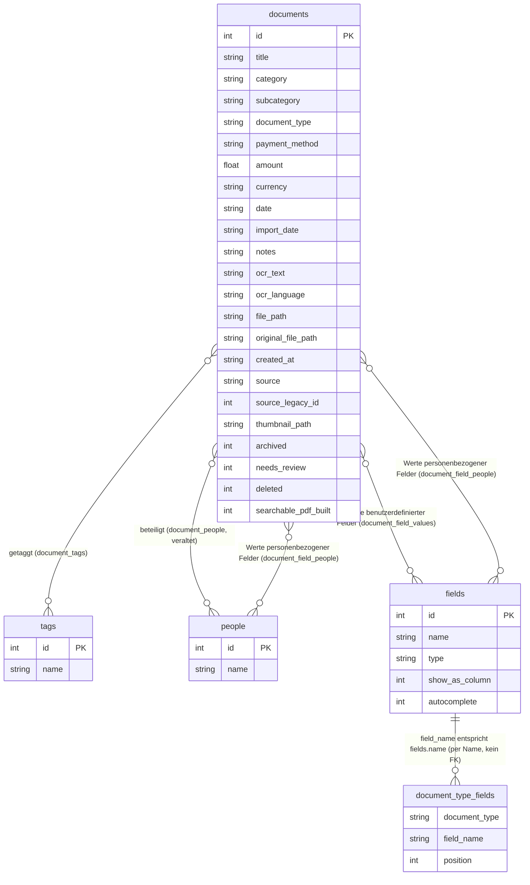

# Dossiary

*[Read this in English](README.md)*

**Neu hier? Starten Sie stattdessen mit dem [Benutzerhandbuch](USER_GUIDE.de.md)**
— diese README behandelt die technischen Interna (Schema, Architektur,
Tests).

Eine konsequent lokale, browserbasierte Dokumentenablage: Dokumente
erfassen, per OCR erkennen, verschlagworten und durchsuchen — kein Server,
kein Konto, kein Upload. Alles liegt in einer einzigen SQLite-Datenbank und
einem Ordner mit Dateien auf Ihrer eigenen Festplatte, die der Browser
direkt öffnet und beschreibt.

## Warum

Die meisten Programme zur Dokumentenverwaltung wollen Ihre Dateien am
liebsten in der Cloud haben. Dossiary macht das Gegenteil: Es ist eine
einzige HTML-Datei, die einen von Ihnen gewählten Ordner über die
[File System Access API](https://developer.mozilla.org/en-US/docs/Web/API/File_System_API)
des Browsers und [sql.js](https://github.com/sql-js/sql.js) (SQLite,
kompiliert nach WebAssembly) liest und beschreibt — nichts wird jemals
irgendwohin hochgeladen. Zeigen Sie auf einen Ordner, und dieser Ordner
*ist* Ihr Archiv.

Außerdem hat es keinerlei native Code-Abhängigkeit und läuft dadurch
identisch auf Apple Silicon oder Intel, macOS/Windows/Linux — überall dort,
wo ein moderner Chromium-Browser läuft — und zwar dauerhaft, ohne das
Risiko des „Intel-only-App funktioniert irgendwann nicht mehr“-Problems,
das dieses Projekt überhaupt erst ausgelöst hat.

## Funktionen

- **Zuletzt geöffnete Bibliotheken** — die letzten 5 von Ihnen geöffneten
  Bibliotheken erscheinen auf dem Startbildschirm; klicken Sie auf eine,
  um sie mit einem einzigen Berechtigungsklick erneut zu öffnen, ohne den
  Ordner erneut auswählen zu müssen. Dazu wird das Zugriffs-Handle des
  Ordners in der IndexedDB Ihres Browsers gespeichert und die Berechtigung
  erneut angefragt — es wird nichts hochgeladen oder kopiert, und auf die
  Daten selbst wird erst beim Klick zugegriffen. Entfernen Sie einen
  Eintrag über das ✕ (z. B. auf einem gemeinsam genutzten Computer, oder
  bei einer Bibliothek, die Sie nicht mehr brauchen) — eine separate
  Einstellung zum Deaktivieren gibt es nicht, das Entfernen ist die
  Abmeldung. Hinweis: Bei `file://`-Seiten wird die IndexedDB-Speicherung
  von allen lokal geöffneten Dateien im Browser gemeinsam genutzt —
  grundsätzlich könnte also auch jede andere lokale HTML-Seite, die Sie
  öffnen, das gespeicherte Zugriffs-Handle einer Bibliothek auslesen,
  bräuchte dafür aber trotzdem Ihren Klick auf „Zulassen" bei einer
  Berechtigungsabfrage, die den echten Ordner nennt.
- **Durchsuchen** — sortierbare, durchsuchbare, filterbare Liste aller
  Dokumente in der Bibliothek, mit Kategorie-/Typ-/Personen-Filtern und,
  für jedes benutzerdefinierte Feld, das in das generische Spaltensystem
  aufgenommen wurde (siehe „Jedes einwertige benutzerdefinierte Feld kann
  zu einer Tabellenspalte, einem Filter und Autocomplete werden“ weiter
  unten), auch dessen eigenem Filter-Dropdown. Die Suche durchsucht Titel,
  Kategorie, Unterkategorie, Dokumenttyp, Notizen, OCR-Text, Tags, Personen
  und den Wert jedes benutzerdefinierten Feldes. Betrag bekommt statt eines
  Dropdowns einen eigenen **Bereichsfilter** (ein Dropdown mit jedem
  einzelnen Betrag wäre nicht sinnvoll) — ein Min- und ein Max-Zahlenfeld
  in der Symbolleiste, beide optional, sowie ein separates Kontrollkästchen
  „Betrag nicht gesetzt“, um Dokumente ohne gespeicherten Betrag zu finden
  (das die Min-/Max-Felder deaktiviert, solange es aktiviert ist, da beide
  sich gegenseitig ausschließende Wege sind, dasselbe Feld zu filtern).
- **Erfassen** — ein neues Dokument (PDF oder Bild) hinzufügen, mit
  clientseitiger OCR über [Tesseract.js](https://github.com/naptha/tesseract.js),
  die vollständig im Browser läuft. Sprachoptionen: Deutsch, Englisch, oder
  beide automatisch erkannt zusammen, außerdem einzeln Französisch,
  Spanisch, Chinesisch (Vereinfacht) und Chinesisch (Traditionell /
  Kantonesisch — Tesseract hat kein eigenes Modell für Kantonesisch, da
  kantonesischer Text mit derselben traditionellen Schrift geschrieben
  wird). Bei JPEG/PNG-Bildern wird zusätzlich ein **durchsuchbares PDF**
  erzeugt — das Bild mit einer unsichtbaren, markierbaren Textebene über
  jedem erkannten Wort (dieselbe „Sandwich“-Technik, die auch Tools wie
  `ocrmypdf` verwenden) — während das Originalbild unverändert in einem
  Unterordner daneben erhalten bleibt, ganz so, wie Mariner Paperless
  selbst verarbeitete und Originaldateien angeordnet hat. Wenn Sie von
  einem Papierdokument ausgehen, erklärt ein Schalter „Need to scan a
  paper document first?“ im Erfassungsformular, wie Sie zuerst mit
  macOS' Digitale Bilder (Image Capture) oder Vorschau scannen können, da
  ein Browser keine Möglichkeit hat, Scanner-Hardware direkt anzusteuern
  — siehe Einschränkungen unten.
- **Inbox** — ein dezentes gelbes Banner erscheint beim Öffnen einer
  Bibliothek, wenn deren `inbox/`-Ordner (im Bibliotheks-Wurzelverzeichnis,
  neben `library.sqlite` und `files/`, und automatisch angelegt, genau wie
  `files/` — keine manuelle Einrichtung nötig, bevor Sie eine Datei von
  Hand hineinlegen oder `scan_watch.py` darauf zeigen lassen) Dateien
  enthält, die noch warten. Klicken Sie auf „Review“, um sie zu sehen, und
  fügen Sie sie mit Standardwerten hinzu (nur die Datei plus ein aus dem
  Dateinamen abgeleiteter Titel) — die restlichen Metadaten bleiben leer,
  zum späteren Ausfüllen über den Bearbeiten-Dialog des Dokuments. Dies
  ergänzt das eigenständige Skript
  [`scan_watch.py`](#scan_watchpy-hilfsskript-für-überwachte-ordner)
  weiter unten, das fertige Scans aus dem Speicherordner Ihrer Scan-Software
  in den `inbox/`-Ordner einer Bibliothek verschiebt — Dossiary selbst
  beobachtet niemals das Dateisystem und legt nie von selbst ein Dokument
  an; ein Dokument aus der Inbox hinzuzufügen erfordert immer diesen
  ausdrücklichen Klick.
- **Prüfliste („Review queue“)** — eine zweite Stufe nach der Inbox: jedes
  aus der Inbox hinzugefügte Dokument (zu diesem Zeitpunkt sind Kategorie,
  Typ und Datum noch leer) wird automatisch als „zu prüfen“ markiert und in
  einem eigenen Bereich oberhalb der Haupttabelle angezeigt, statt an
  einer möglicherweise unbemerkten Stelle darin einsortiert zu werden.
  Klicken Sie bei einem Dokument in der Prüfliste auf „Edit“, um seine
  Metadaten auszufüllen, oder klicken Sie auf die Zeile, um es zu öffnen.
  Nur der ausdrückliche „Done“-Button — auf der Zeile in der Prüfliste
  selbst oder in der Detailansicht des Dokuments — hebt die Markierung auf
  und verschiebt das Dokument in die Haupttabelle; das Speichern einer
  Zwischenbearbeitung tut dies nicht, sodass Sie Ihren Fortschritt
  zwischenspeichern können, ohne Ihren Platz in der Prüfliste zu verlieren.
  Jedes Dokument kann auf diese Weise markiert werden, nicht nur
  Inbox-Importe — öffnen Sie ein Dokument und klicken Sie auf „Flag for
  review“, wenn Sie später darauf zurückkommen möchten. Markierung und
  Archivierung sind voneinander unabhängig: Ein archiviertes Dokument zu
  markieren hebt die Archivierung nicht auf, und umgekehrt — ein
  archiviertes Dokument bleibt nur über „Show archived“ in der
  Haupttabelle erreichbar, wie jedes andere archivierte Dokument auch.
- **Papierkorb** — „Delete“ bei einem Dokument zerstört nichts wirklich; es
  verschiebt das Dokument nur in den „🗑 Waste bin“ (aus der Symbolleiste),
  wo es bleibt, bis Sie auf „Restore“ klicken — es gibt nirgendwo eine
  Funktion zum Leeren des Papierkorbs, sodass nichts, was Sie löschen, je
  wirklich verschwindet. Ein gelöschtes Dokument ist überall sonst
  ausgeblendet, auch in der Haupttabelle mit aktiviertem „Show archived“
  und in der Prüfliste, und seine Detailansicht bietet bis dahin nur
  „Restore“ an. Dateien auf der Festplatte, Vorschaubilder und die
  `.txt`-Begleitdatei werden in beide Richtungen nie angefasst.
- **Reports** — eine 4. Navigationsansicht, die Ihre Dokumente nach Category, Type,
  People oder benutzerdefinierten Feldern summiert, gruppiert nach Währung,
  damit Beträge in verschiedenen Währungen nie zusammengezählt werden, mit
  einem Datumsbereichsfilter und einem druckfreundlichen Layout für
  Steuererklärung oder Spesenerstattung.
- **Collections** — organisieren Sie Dokumente in Ihren eigenen benannten Gruppierungen, erreichbar über einen erweiterbaren Collections-Bereich in der Navigation. Manuelle Collections sind handgewählte Listen (wählen Sie Dokumente in der Tabelle aus, um sie stapelweise einer Collection hinzuzufügen, zu archivieren, zu löschen oder zur Überprüfung zu kennzeichnen, oder fügen Sie sie einzeln aus der Detailansicht eines Dokuments hinzu); Smart Collections speichern Ihren aktuellen Such-/Kategorie-/Typ-/Personen-/Feldfilter als Live-View, die automatisch neu hinzugekommene Dokumente weiterhin berücksichtigt.
- **Spotlight-/Finder-Suche** — jedes erfasste Dokument bekommt zusätzlich
  eine einfache `.txt`-Begleitdatei (Sidecar-Datei) daneben (Titel,
  Kategorie, Tags, Notizen, OCR-Text, Werte der benutzerdefinierten
  Felder), damit die in macOS eingebaute Dateisuche auch nach Feldern
  finden kann, die sonst nur innerhalb von `library.sqlite` existieren.
  Das ist keine echte Spotlight-*Integration* (aus einem Browser heraus
  nicht möglich — siehe Einschränkungen unten), sondern lediglich eine
  ganz gewöhnliche Textdatei, die wie jede andere mitindiziert wird.
- **Vollständig generische benutzerdefinierte Felder** — Text-, Zahlen-,
  Datums-, Checkbox- und Personen-Felder (Organisation, Jahr, Datum von,
  Bezahlt, Erstattungsfähig, Autor, Mitwirkende — was auch immer Ihre
  Bibliothek nutzt) werden alle auf dieselbe Weise abgebildet, aus
  Mariners eigenen Felddefinitionen und Werten übernommen. Kein fest
  vorgegebener Satz an Feldern. Ein Feld vom Typ „Person" funktioniert wie
  Personen selbst (siehe „Verschlagworten & organisieren" unten):
  kommagetrennt, ein Dokument kann sich über dieses Feld auf mehr als eine
  Person beziehen, und jedes Personen-Feld greift auf dieselbe zugrunde
  liegende Namensliste zu — ein bei Autor eingetragener Name wird also
  genauso automatisch vervollständigt und durchsucht wie einer bei
  Personen.
- **Verschlagworten & organisieren** — Kategorie, Unterkategorie,
  Dokumenttyp, Zahlungsmethode, Betrag, Datum, Notizen, Personen,
  benutzerdefinierte Felder und freie Tags pro Dokument — ein Dokument
  kann sich auf mehr als eine Person beziehen und ist genauso filterbar
  wie über Tags
- **Originale öffnen** — ein Klick öffnet die eigentliche Datei direkt von
  der Festplatte
- **Dateipfade in der Detailansicht** — eine Zeile „File" (und „Original"
  bei einem erfassten Bild, das in ein durchsuchbares PDF umgewandelt
  wurde) zeigt den Pfad relativ zu Ihrem Bibliotheksordner, damit Sie die
  Datei selbst im Finder (macOS), im Explorer (Windows) oder Ihrem
  Dateimanager (Linux) finden können. Browser haben keine Möglichkeit,
  eine Datei direkt im Dateimanager des Betriebssystems anzuzeigen oder
  ihren absoluten Pfad offenzulegen — das ist so nah, wie die App
  herankommt.
- **Bearbeiten** — auf ein Dokument klicken, dann „Edit“, um dessen
  Metadaten nachträglich zu ändern (Titel, Kategorie, Unterkategorie, Typ,
  Zahlungsmethode, Betrag, Datum, Personen, Tags, Werte benutzerdefinierter
  Felder, Notizen, OCR-Text). Dabei wird ausschließlich `library.sqlite`
  verändert — die zugrunde liegende Datei auf der Festplatte wird nie
  angefasst oder ersetzt.
- **Konfigurierbare Spalten & Filter** — über den Schalter „⚙ Columns“ in
  der Symbolleiste lassen sich Tabellenspalten ein-/ausblenden (Kategorie,
  Typ, Zahlungsmethode, Personen, Datum, Importiert, Betrag, Tags); jede
  Spalte, die Filterung unterstützt, blendet dabei gleichzeitig ihr
  passendes Filter-Dropdown ein oder aus. Die Auswahl wird in
  `library.sqlite` selbst gespeichert und reist damit mit dem
  Bibliotheksordner mit, statt an einen Browser oder ein Gerät gebunden zu
  sein. (Benutzerdefinierte Felder als Tabellenspalten/Filter sind geplant,
  aber noch nicht umgesetzt — siehe Einschränkungen.)
- **Die Tabellenkopfzeile bleibt beim Scrollen sichtbar** — nützlich,
  sobald eine Bibliothek genug Dokumente enthält, dass die Liste wirklich
  scrollt. Die Dokumentliste selbst ist ein begrenzter, unabhängig
  scrollender Bereich (nicht die ganze Seite), sodass die Spaltenköpfe
  (und die Möglichkeit, durch Klicken zu sortieren) immer erreichbar
  bleiben, egal wie weit unten in der Liste man sich befindet.
- **Dokumentvorschauen** — jedes Dokument kann in seiner Detailansicht ein
  kleines Vorschaubild anzeigen. Migrierte Dokumente erhalten Mariners
  eigenes Vorschaubild, direkt von `migrate_to_new_library.py` übernommen.
  Neu erfasste Dokumente bekommen automatisch eines erzeugt (ein Bild wird
  direkt verkleinert; bei einem PDF wird die erste Seite über
  [pdf.js](https://mozilla.github.io/pdf.js/) gerendert). Ein Schalter
  „Generate preview“ / „Regenerate preview“ in der Detailansicht erlaubt
  es, für jedes Dokument ohne Vorschau eine zu erzeugen, oder eine
  bestehende zu erneuern.
- **Dynamische Felder pro Dokumenttyp** — Erfassungs-/Bearbeitungsformulare
  zeigen nur die benutzerdefinierten Felder (und Personen), die für den
  jeweils gewählten Dokumenttyp konfiguriert sind, in der konfigurierten
  Reihenfolge — genau wie Mariner Paperless selbst entschieden hat, welche
  Felder pro Typ angezeigt werden. Ein nicht konfigurierter Dokumenttyp
  (ein brandneuer Typ, oder eine Bibliothek, in der das nie erfasst wurde)
  zeigt gar keine benutzerdefinierten Felder — genau wie bei Mariner
  müssen Felder einem Typ erst ausdrücklich zugewiesen werden, bevor sie
  erscheinen.
- **Das Datum wird beim Erfassen standardmäßig auf heute gesetzt** — das
  ist bei einem frisch eingegangenen Dokument richtig, bei der
  Nacherfassung älterer Post aber falsch, deshalb ist es optisch
  gekennzeichnet (bernsteinfarben, mit einem „bitte prüfen“-Hinweis), bis
  Sie das Feld tatsächlich anfassen — so gibt sich eine ungeprüfte
  Vermutung nicht stillschweigend als echter Wert aus.
- **Lösch-Button bei jedem Datalist-Feld, plus Betrag und Währung** — ein
  kleines „✕“ bei Kategorie, Unterkategorie, Dokumenttyp, Zahlungsmethode,
  Personen, Tags, Betrag und Währung, sowohl im Erfassungs- als auch im
  Bearbeitungsformular, leert das jeweilige Feld und setzt den Fokus
  wieder dorthin — bei den Datalist-gestützten Feldern klappt dabei die
  vollständige Liste vorhandener Werte wieder auf, statt weiter auf das
  bereits Eingetippte gefiltert zu bleiben, praktisch, wenn Sie einen
  anderen Wert aus der Liste wählen statt neu tippen möchten.
- **OCR für ein bestehendes Dokument erneut ausführen** — der
  Bearbeiten-Dialog hat einen eigenen „Run OCR“-Button, der nur das
  OCR-Textfeld anhand der tatsächlich gespeicherten Datei des Dokuments
  aktualisiert. Anders als das Erfassungsformular (nur Bilder)
  funktioniert das auch bei PDFs — der Großteil der gespeicherten
  Dokumente —, indem zunächst die erste Seite in ein Bild gerendert wird.
- **Der Dokumenttyp ist auffällig platziert, nahe am Anfang beider
  Formulare** — da er das eine Feld ist, das bestimmt, ob Organisation,
  Personen oder überhaupt benutzerdefinierte Felder erscheinen (siehe
  „Dynamische Felder pro Dokumenttyp“), ist er bewusst nicht einfach nur
  irgendein Feld in der Mitte des Formulars. Erst diesen wählen, dann
  spiegelt alles darunter diese Wahl wider.
- **Feldeinstellungen** — der Schalter „⚙ Manage fields“ öffnet einen
  Dialog zur Verwaltung, welche Felder pro Dokumenttyp angezeigt werden
  (und in welcher Reihenfolge), dazu ein Standard-Dokumenttyp und eine
  Standardwährung, die das Erfassungsformular vorausfüllen (siehe „Betrag
  hat ein verknüpftes Währungsfeld“ unten), sowie zwei Kontrollkästchen
  pro Feld — **Column** und **Autocomplete** (siehe unten) — verfügbar
  für jedes echte benutzerdefinierte Feld. Entspricht Mariner Paperless'
  eigenem Bildschirm für Dokumenttypen/Felder/Anzeigefelder: links einen
  Typ wählen, in der mittleren Spalte Felder dazu hinzufügen, rechts
  umsortieren oder entfernen — Änderungen werden sofort gespeichert.
  Bewusst beschränkt auf bereits genutzte Dokumenttypen (ein brandneuer
  Typ entsteht durch Eintippen im Erfassungs-/Bearbeitungsformular, nicht
  in diesem Dialog) und auf das Ein-/Ausblenden bzw. Umsortieren
  *bestehender* benutzerdefinierter Felder — neue werden hier nicht von
  Grund auf erstellt (siehe unten, wo das stattdessen geschieht).
  **Zahlungsmethode ist ein ganz gewöhnliches benutzerdefiniertes Feld**
  — obwohl es in Mariner selbst ein verpflichtendes, immer vorhandenes
  Feld war, gibt es für ein allgemeines Werkzeug keinen Grund, es als
  fest einprogrammierten Sonderfall zu behandeln; es ist einfach eine
  weitere Zeile in der Feldliste: pro Dokumenttyp ein-/ausblendbar,
  umsortierbar und (siehe unten) genau wie alles andere spalten-/
  filter-/autocomplete-fähig. Betrag behält eine kleine, bewusste
  Ausnahme — siehe „Betrag hat ein verknüpftes Währungsfeld“. Ein Dokument
  in einen Typ umzuklassifizieren, für den ein Feld nicht konfiguriert
  ist, verwirft nie den bereits gespeicherten Wert — er wird nur nicht
  angezeigt, bis Sie entweder das Feld für diesen Typ wieder hinzufügen
  oder erneut umklassifizieren. Die Kopfzeile der Detailansicht
  berücksichtigt das ebenfalls: Zahlungsmethode und Betrag erscheinen dort
  nur, wenn ein Dokument tatsächlich einen Wert dafür hat, statt immer
  einen leeren Platzhalter anzuzeigen.
- **Jedes einwertige benutzerdefinierte Feld kann zu einer Tabellenspalte,
  einem Filter und Autocomplete werden** — zwei Kontrollkästchen neben
  jedem Feld in der Feldliste der Feldeinstellungen (nicht verfügbar für
  Personen-Felder wie Personen, Autor oder Mitwirkende — siehe
  Einschränkungen). **Column** fügt eine
  sortierbare Tabellenspalte hinzu (auf die Kopfzeile klicken zum
  Sortieren, bei Zahlenfeldern numerisch) und, bei Text-/Checkbox-Feldern,
  ein Filter-Dropdown in der Symbolleiste, gebildet aus den tatsächlichen,
  in Ihrer Bibliothek vorkommenden Werten — Zahlen-/Datumsfelder bekommen
  die Spalte ohne Filter-Dropdown, genau wie es bei den eingebauten
  Spalten Datum und Betrag bereits funktioniert, da ein Dropdown mit jeder
  einzelnen Zahl oder jedem Datum nicht sinnvoll wäre. **Autocomplete**
  (nur Textfelder) schlägt beim Tippen bereits verwendete Werte vor —
  derselbe Mechanismus, den auch Zahlungsmethode inzwischen nutzt. Beide
  sind bei einem neu erstellten Feld zunächst deaktiviert, damit ein
  frisches benutzerdefiniertes Feld die Tabelle oder Symbolleiste nicht
  überfüllt, bevor Sie entscheiden, dass es dort sichtbar sein soll.
- **Jedes Feld kann eine kurze Beschreibung erhalten** — der Bereich
  „Feldbeschreibungen" in den Feldeinstellungen listet jedes Feld auf,
  eingebaute (Kategorie, Unterkategorie, Dokumenttyp, Datum, Tags) wie
  benutzerdefinierte gleichermaßen, jeweils mit eigenem optionalem Text.
  Nützlich für ein Feld, dessen Name allein nicht genug aussagt — etwa um
  klarzustellen, dass „Organization" auch den Namen einer Person enthalten
  kann, nicht nur den einer Firma. Einmal gesetzt, erscheint sie als
  kleiner Hinweistext unter der Feldbeschriftung sowohl im Erfassungs- als
  auch im Bearbeitungsformular; ein Feld ohne gesetzten Text zeigt gar
  keinen Hinweis. Dokumenttyp ist das einzige Feld, das bereits einen
  eigenen eingebauten Hinweis hatte („Nicht in der Liste? Einfach einen
  neuen Typ eintippen — er wird angelegt.") — wird dort zusätzlich eine
  Beschreibung gesetzt, erscheinen beide gestapelt, statt den
  ursprünglichen zu ersetzen.
- **Ein benutzerdefiniertes Feld direkt aus dem Erfassungs-/
  Bearbeitungsformular anlegen** — ein Schalter „+ Add a custom field“
  unterhalb der benutzerdefinierten Felder, verborgen, bis ein
  Dokumenttyp eingetragen ist (ein Feld muss immer zu *irgendeinem* Typ
  gehören). Namen und Typ wählen (Text/Zahl/Datum/Checkbox/Person — keine
  Währungsoption; für einen Geldbetrag stattdessen das eingebaute
  Betrags-Feld verwenden, worauf das Formular hinweist), und es wird
  sofort erstellt und im gerade bearbeiteten Dokument angezeigt — kein
  Umweg über die Feldeinstellungen nötig, und dafür auch kein vorab
  angelegter Dokumenttyp erforderlich, was wichtig ist für eine
  Bibliothek, die noch nie ein benutzerdefiniertes Feld hatte (nichts aus
  Mariner übernommen, noch nichts angelegt). Ein Feld auf diesem Weg
  hinzuzufügen stört nie etwas bereits in *andere* Felder des Dokuments
  Eingetragenes — ein reales Risiko, das bewusst von vornherein vermieden
  wurde, nicht nur nachträglich getestet; eine naive Umsetzung, die
  einfach den gesamten Bereich der benutzerdefinierten Felder neu
  gerendert hätte, hätte stillschweigend bereits Ausgefülltes verworfen.
  Ein bereits verwendeter Name wird abgelehnt, statt ihn stillschweigend
  an den aktuellen Typ anzuhängen oder zu duplizieren — dafür stattdessen
  die Feldeinstellungen verwenden (die ohnehin jedes bestehende Feld
  auflisten).
- **Betrag hat ein verknüpftes Währungsfeld** — beide sind inzwischen
  technisch ganz gewöhnliche benutzerdefinierte Felder (ihre Eingabefelder
  in Erfassung/Bearbeitung sind zwei normale, unabhängig platzierte
  Felder, jedes mit eigenem Lösch-Button). Betrag allein behält eine
  bewusste Ausnahme vom sonst vollständig generischen System: Es bekommt
  keine Column-/Autocomplete-Kontrollkästchen in den Feldeinstellungen, und
  seine *Tabellenspalte und Zeile in der Detailansicht* bleiben immer mit
  der Währung zu einer Anzeige „123.45 EUR“ zusammengefasst (Betrag, dann
  Währung, immer in dieser Reihenfolge) statt eine eigene Spalte zu werden
  — das Sortieren dieser zusammengefassten Betrags-Spalte sortiert nur nach
  der reinen Zahl, und es gibt keine Währungsumrechnung, da dies eine
  persönliche Dokumentenablage ist, kein Buchhaltungsprogramm. **Währung
  selbst ist ein ganz gewöhnliches benutzerdefiniertes Feld, genau wie
  Zahlungsmethode** — sie bekommt ihre eigene, optionale Tabellenspalte,
  ein Filter-Dropdown in der Symbolleiste (mit jeder tatsächlich in Ihrer
  Bibliothek verwendeten Währung, plus „— Nicht gesetzt —“) und
  Autocomplete, über die Column-/Autocomplete-Kontrollkästchen der
  Feldeinstellungen ein-/ausschaltbar wie bei jedem anderen Textfeld —
  völlig unabhängig von der oben beschriebenen zusammengefassten
  Betrag/Währung-Anzeige, die unverändert weiterfunktioniert, egal ob die
  eigene Spalte der Währung gerade eingeblendet ist oder nicht. Das
  Autocomplete der Währung schöpft aus bereits in der Bibliothek
  verwendeten Währungen statt aus einem festen Dropdown, da echte Dokumente
  Symbole wie „€“/„$“ und Codes wie „EUR“/„USD“ mischen und freier Text es
  unmöglich macht zu wissen, ob ein Wert als vorangestelltes Symbol oder
  nachgestellter Code gemeint ist. Eine **Standardwährung**, einmalig in den
  Feldeinstellungen festgelegt, ist optional und standardmäßig nicht
  gesetzt — wenn konfiguriert, füllt sie das Währungsfeld neuer Erfassungen
  genauso vor wie das Datumsfeld auf heute vorausgefüllt wird: optisch als
  Vorschlag gekennzeichnet (bernsteinfarben, mit „bitte prüfen“-Hinweis),
  bis Sie das Feld tatsächlich anfassen. Es ist eine Einstellung pro
  Bibliothek, keine fest einprogrammierte Annahme, da Dossiary ein
  allgemeines, herunterladbares Einzeldatei-Werkzeug ist — eine feste
  Vorgabe wäre für jeden, dessen Bibliothek nicht in genau dieser Währung
  geführt wird, stillschweigend falsch. Auch beim Bearbeiten wird
  vorgeschlagen, allerdings nur bei einem Dokument, das bereits einen
  echten Betrag, aber keine gespeicherte Währung hat — etwa eines, das
  erfasst wurde, bevor je eine Standardwährung eingestellt war —, damit
  diese Lücke tatsächlich geschlossen werden kann, statt die Währung von
  Grund auf neu eintippen zu müssen. Jede andere leere Währung beim
  Bearbeiten (kein Betrag, oder ein Betrag von null) bleibt unangetastet:
  Das ist der echte, gespeicherte Zustand des Dokuments, kein Rateversuch.
- **Bearbeiten verbirgt nie Daten hinter einer Konfigurationsänderung** —
  wenn ein Dokument einen Wert in einem Feld hat, das für seinen
  aktuellen Typ nicht (mehr) konfiguriert ist — weil es umklassifiziert
  wurde, oder das Feld in den Feldeinstellungen aus diesem Typ entfernt
  wurde —, zeigt der Bearbeiten-Dialog ihn trotzdem an, angehängt nach
  den regulär konfigurierten Feldern und optisch markiert („Not shown for
  this document type“), sodass Sie immer die Möglichkeit haben, ihn zu
  prüfen, zu korrigieren oder zu löschen. Er erscheint nur dann nicht
  mehr, wenn er einmal gelöscht wurde, oder wenn Sie den Dokumenttyp auf
  etwas ändern, das ihn nicht enthält, und ihn dabei nicht anfassen.
- **Deutsche/englische Oberfläche** — die gesamte Benutzeroberfläche
  (nicht nur OCR — siehe „Erfassen" oben) lässt sich über den Schalter in
  der Fußzeile zwischen Englisch und Deutsch umschalten; sie startet
  passend zur Sprache Ihres Browsers und merkt sich danach Ihre Wahl.

## Erste Schritte

1. Öffnen Sie `dossiary.html` direkt in **Chrome oder Edge** (Doppelklick,
   oder in ein Browserfenster ziehen — nicht in einer eingebetteten
   Vorschau öffnen; Schreibzugriff auf Ordner erfordert eine echte
   Top-Level-Seite).
2. Klicken Sie auf **„Open library folder“** und wählen Sie einen Ordner.
   Ist er leer, wird Ihnen angeboten, dort eine neue Bibliothek
   anzulegen. Enthält er bereits ein `library.sqlite` (z. B. aus einer
   Migration — siehe unten), öffnet es sich direkt mit Ihren vorhandenen
   Dokumenten.
3. Klicken Sie auf **„＋ Add document“**, um etwas Neues zu erfassen.

### Als App installieren (derzeit nicht verfügbar)

Chrome und Edge haben beide eine Funktion, die eine bereits geöffnete Seite
in etwas verwandelt, das wie eine native App aussieht und startet — mit
eigenem Symbol und eigenem Fenster, ohne Tabs oder Adressleiste. Das
funktionierte früher auch für eine Datei, die direkt von der Festplatte
geöffnet wurde, aber aktuelle Versionen beider Browser beschränken das auf
Seiten, die von einem echten `http://`/`https://`-Ursprung ausgeliefert
werden — öffnet man `dossiary.html` direkt (`file://...`), sind sowohl
**Create Shortcut…** (Chrome) als auch **Install this site as an app**
(Edge) ausgegraut, bestätigt in beiden Browsern. Das ist eine
Browser-seitige Einschränkung des `file://`-Protokolls selbst, kein Fehler
in dieser App und auch nicht durch ein Manifest zu beheben.

Die Datei direkt in einem normalen Browser-Tab zu öffnen funktioniert in
jedem Fall genau gleich — das war immer nur eine kosmetische Annehmlichkeit,
nie eine Voraussetzung. Wer den Look eines eigenen Fensters unbedingt haben
möchte, hat als einzige echte Umgehung die Möglichkeit, die Datei über
`http://` statt direkt zu öffnen (z. B. `python3 -m http.server` im
Bibliotheksordner ausführen und dann `http://localhost:8000/dossiary.html`
öffnen) — das führt aber genau den „braucht einen Server“-Schritt wieder
ein, den dieses Projekt eigentlich vermeiden soll, und wird hier deshalb
nicht standardmäßig empfohlen.

### Von einem anderen Werkzeug wechseln?

Wenn Sie von der eingestellten App Mariner Paperless kommen, finden Sie
die Konvertierungswerkzeuge und die einzelnen Schritte in
[MIGRATION.de.md](MIGRATION.de.md).

### scan_watch.py (Hilfsskript für überwachte Ordner)

Ein kleines eigenständiges Python-Skript (nur Standardbibliothek — kein
`pip install` nötig), das einen Ordner überwacht, in den Ihre
Scan-Software fertige Scans speichert (z. B. das eigene
„Speichern in Ordner“-Ziel von ScanSnap Home), und jede stabile Datei in
den `inbox/`-Ordner einer Dossiary-Bibliothek verschiebt, damit die
oben beschriebene Inbox-Funktion in der App sie aufgreifen kann:

```
python3 scan_watch.py --drop-folder ~/Scans --library ~/Documents/MyLibrary
```

Standardmäßig läuft es dauerhaft (prüft alle `--poll-interval` Sekunden,
Standard 2), oder einmalig mit `--once`. Eine Datei wird erst verschoben,
wenn sie `--settle-seconds` (Standard 2) lang nicht mehr verändert wurde,
damit ein noch geschriebener Scan nicht mitten im Schreibvorgang erfasst
wird.

Das Skript arbeitet bewusst ausschließlich auf Dateisystemebene — es
fasst `library.sqlite` selbst nie an, vergibt keine Dokument-IDs und
setzt keine Metadaten. Dossiary ist der einzige Schreibzugriff auf
`library.sqlite` (die gesamte Datenbank wird im Browser-Tab in den
Speicher geladen und nur bei einem expliziten Speichern wieder
zurückgeschrieben), sodass ein zweiter Prozess, der direkt Zeilen
einfügt, stillschweigend Arbeit verlieren könnte, je nachdem, welche
Seite zuletzt gespeichert hat. Dieses Skript auf „nur die Datei
verschieben“ zu beschränken, umgeht dieses Risiko vollständig und
bedeutet, dass niemals etwas ohne einen expliziten Klick innerhalb der
App selbst zu Ihrem Archiv hinzugefügt wird — ganz im Sinne von Dossiarys
eigenem Prinzip „keine stillschweigenden Schreibvorgänge“ (Dokumente
entstehen ausschließlich durch etwas, das Sie angeklickt haben, nicht
durch Daten, die von selbst auf der Festplatte auftauchen).

## Datenbankschema



`document_type_fields.document_type` und `documents.document_type` werden
über den reinen Textnamen abgeglichen, nicht über einen SQLite-Fremdschlüssel
— genau wie `category`/`subcategory`/`payment_method` bei `documents` selbst
speichert dieses Schema aufgelöste Namen direkt als `TEXT`, statt eigene
Nachschlagetabellen zu führen, sodass es keinen echten Fremdschlüssel mehr
gibt, gegen den man verweisen könnte. `document_field_people` ist eigentlich
eine dreiseitige Beziehung (Dokument × Feld × Person), oben der
Übersichtlichkeit halber als zwei separate binäre Linien dargestellt statt
als eigene Box. `document_people` ist veraltet — siehe unten. `settings`
wird hier nicht gezeigt, da es eine reine Schlüssel-Wert-Tabelle ohne
Beziehungen zu anderen Tabellen ist; siehe die eigene Beschreibung unten.

Das Diagramm oben ist ein relationaler Überblick; die vollständige,
spaltenweise Auflistung (Typen, Standardwerte und die Gründe hinter
veralteten/nullbaren Spalten) folgt:

```
documents
    id                  INTEGER PRIMARY KEY
    title               TEXT
    category            TEXT
    subcategory         TEXT     -- unabhängig von category, KEIN Kind davon (siehe Hinweis unten)
    document_type       TEXT
    payment_method      TEXT     -- VESTIGIAL -- siehe „fields“/„document_field_values“
    amount              REAL     -- unten. Wird nicht mehr gelesen oder geschrieben; bleibt
    currency            TEXT     -- (nie gelöscht) erhalten, damit alte Bytes nicht zerstört werden.
    date                TEXT     -- ISO 8601, das eigene Datum des Dokuments (z. B. Rechnungsdatum)
    import_date         TEXT     -- ISO 8601, wann das Dokument gescannt/erfasst/importiert wurde
                                  -- (bei migrierten Dokumenten stammt das aus Mariners eigenem
                                  -- Importdatum; bei erfassten Dokumenten entspricht es created_at)
    notes               TEXT
    ocr_text            TEXT
    ocr_language        TEXT     -- 'deu' / 'eng' / 'eng+deu' / NULL
    file_path           TEXT     -- relativ zur Bibliothekswurzel, z. B. "files/3_invoice.pdf"
    original_file_path  TEXT     -- relativ zur Bibliothekswurzel; jetzt bei jedem neuen
                                  -- Dokument gesetzt (Posteingang oder Erfassung), nicht
                                  -- mehr nur bei durchsuchbaren PDFs
    searchable_pdf_built INTEGER -- 0/1, Standard 0; ob Dossiarys eigene OCR+jsPDF-Pipeline
                                  -- die Datei erzeugt hat, die aktuell unter file_path liegt --
                                  -- allein das Vorhandensein von original_file_path bedeutet
                                  -- das nicht mehr
    created_at          TEXT     -- ISO 8601, wann der Datensatz angelegt wurde
    source              TEXT     -- 'migrated', 'captured' oder 'scan-inbox'
    source_legacy_id    INTEGER  -- nur zur Nachvollziehbarkeit, bei migrierten Dokumenten
    thumbnail_path      TEXT     -- relativ zur Bibliothekswurzel, nullable
    archived            INTEGER  -- 0/1, Standard 0; umkehrbare Markierung „nicht mehr
                                  -- benötigt“, in der Standardansicht ausgeblendet --
                                  -- siehe Funktionen oben
    needs_review        INTEGER  -- 0/1, Standard 0; Markierung „noch nicht geprüft“,
                                  -- erscheint in der Prüfliste statt in der Haupttabelle --
                                  -- siehe Funktionen oben
    deleted             INTEGER  -- 0/1, Standard 0; Soft-Delete-Markierung, nur über den
                                  -- Papierkorb erreichbar -- siehe Funktionen oben. Keine
                                  -- Datei/kein Vorschaubild/keine Begleitdatei wird je
                                  -- angefasst, und es gibt keine Funktion zum Leeren.

tags
    id    INTEGER PRIMARY KEY
    name  TEXT UNIQUE

document_tags
    document_id  INTEGER
    tag_id       INTEGER
    PRIMARY KEY (document_id, tag_id)

people
    id    INTEGER PRIMARY KEY
    name  TEXT UNIQUE

document_people
    document_id  INTEGER      -- VESTIGIAL -- siehe „fields“/„document_field_people“ unten.
    person_id    INTEGER      -- Wird nicht mehr gelesen oder geschrieben; bleibt (nie gelöscht)
    PRIMARY KEY (document_id, person_id)   -- erhalten, damit alte Bytes nicht zerstört werden.

settings
    key    TEXT PRIMARY KEY
    value  TEXT

fields
    id                INTEGER PRIMARY KEY
    name              TEXT UNIQUE
    type              TEXT      -- 'text', 'number', 'date', 'checkbox' oder 'person'
    show_as_column    INTEGER   -- 0/1; fügt eine sortierbare Tabellenspalte hinzu, und (nur bei
                                  -- text/checkbox) ein Filter-Dropdown in der Symbolleiste.
                                  -- Nicht verfügbar für Felder vom Typ 'person' (siehe unten).
    autocomplete      INTEGER   -- 0/1; nur bei text-Feldern -- schlägt beim Tippen bereits
                                  -- verwendete Werte vor

document_field_values
    document_id  INTEGER
    field_id     INTEGER
    value        TEXT     -- immer als Text gespeichert; wird beim Lesen anhand von fields.type interpretiert.
    PRIMARY KEY (document_id, field_id)   -- Nicht verwendet für Felder vom Typ 'person' -- siehe unten.

document_field_people
    document_id  INTEGER
    field_id     INTEGER  -- eine `fields`-Zeile vom Typ 'person' -- Personen, Autor, Mitwirkende, ...
    person_id    INTEGER
    PRIMARY KEY (document_id, field_id, person_id)

document_type_fields
    document_type  TEXT
    field_name     TEXT      -- ein Name aus `fields` -- schließt jetzt auch 'People' selbst ein,
                              -- nicht nur benutzerdefinierte Felder (siehe unten)
    position       INTEGER   -- Anzeigereihenfolge innerhalb dieses Dokumenttyps
    PRIMARY KEY (document_type, field_name)
```

`settings` ist eine kleine Schlüssel-Wert-Tabelle für App-Einstellungen,
die mit der Bibliothek mitreisen sollen statt im Browser-Speicher zu
liegen — aktuell `visible_columns` (ein JSON-Array, welche Tabellenspalten
und ihre passenden Filter angezeigt werden), `default_document_type`
(füllt das Dokumenttyp-Feld des Erfassungsformulars vor) und
`default_currency` (füllt das Währungsfeld neuer Erfassungen als
löschbaren Vorschlag vor — siehe Funktionen oben; standardmäßig nicht
gesetzt, da dies ein allgemeines Werkzeug ist, für das keine Währung für
alle richtig anzunehmen wäre).

**Benutzerdefinierte Felder sind vollständig generisch** (`fields` +
`document_field_values` für einwertige Typen, `fields` +
`document_field_people` für Felder vom Typ `person`) — Organisation, Jahr,
Datum von, Bezahlt, Zahlungsmethode, Betrag, Währung, Personen, Autor,
Mitwirkende, was auch immer Ihre Bibliothek tatsächlich nutzt. Jedes Feld
hat einen Typ (`text`/`number`/`date`/`checkbox`/`person`), der bestimmt,
wie es dargestellt und wie sein Wert interpretiert wird, plus die oben
beschriebenen Fähigkeits-Flags `show_as_column`/`autocomplete` (nicht
verfügbar für Felder vom Typ `person` — ein mehrwertiges Feld passt nicht
in eine einzelne Tabellenzelle oder ein sinnvolles Filter-Dropdown, so wie
ein einwertiges Feld das tut). Wird von `migrate_to_new_library.py` aus
Mariners eigenen Felddefinitionen und echten Werten für migrierte
Bibliotheken befüllt, sowie von zwei einmaligen, idempotenten Migrationen,
die bei jedem Öffnen einer Bibliothek laufen: `migrateSentinelFieldsToGeneric()`
für Zahlungsmethode/Betrag/Währung, und `migratePeopleToGenericField()`
für Personen selbst — beide befördern, was früher ein fest einprogrammierter
Sonderfall war (eigens dafür vorgesehene `documents`-Spalten beim einen,
die einzelne Tabelle `document_people` beim anderen), zu gewöhnlichen
`fields`-Zeilen, samt Übernahme jedes bereits unter der alten Form
gespeicherten Werts. Neue Felder, einschließlich neuer Felder vom Typ
`person`, lassen sich auch direkt aus den Erfassungs-/
Bearbeitungsformularen anlegen (Schalter „+ Add a custom field“) — siehe
Funktionen oben.

`document_type_fields` steuert das dynamische Feldverhalten der
Erfassungs-/Bearbeitungsformulare (siehe „Dynamische Felder pro
Dokumenttyp“ oben): Für einen in dieser Tabelle vorhandenen Dokumenttyp
werden nur die aufgeführten Felder angezeigt — Personen eingeschlossen,
da es hier jetzt ein ganz gewöhnlicher Feldname ist, kein Sonderfall mehr
—, in der angegebenen Reihenfolge. Ein in dieser Tabelle fehlender Typ
zeigt **überhaupt keine** benutzerdefinierten Felder — genau wie bei
Mariner müssen Felder einem Typ erst ausdrücklich zugewiesen werden,
bevor sie erscheinen. Wird von `migrate_to_new_library.py` befüllt, das
Mariners eigene Anzeigefeld-Konfiguration pro Typ dekodiert; dessen
`'People'`-Zeilen brauchten keine eigene Migration, als Personen zu einem
echten Feld wurde — die Spalte enthielt bereits genau diese Zeichenkette
und stimmt weiterhin unverändert überein.

Jedes Feld vom Typ `person` (Personen, Autor, Mitwirkende, ...)
funktioniert wie Tags: Ein Dokument kann sich über dieses Feld auf mehr
als eine Person beziehen (eine gemeinsame Rechnung, gemeinsame Autoren,
ein gemeinsamer Termin usw.), es handelt sich also um eine
Mehrfachbeziehung (`document_field_people`, sowohl nach Feld als auch
nach Dokument geschlüsselt), kein einzelner Textwert — und jedes
Personen-Feld greift auf dieselbe zugrunde liegende Tabelle `people` zu,
sodass ein bei Autor eingetragener Name genauso automatisch
vervollständigt und durchsucht wird wie einer bei Personen. Bei
migrierten Dokumenten wird Personen speziell aus Mariners
benutzerdefiniertem Feld „Person“ übernommen — das manchmal mehrere, mit
„&“ verbundene Namen enthielt (z. B. „Arne & Jana“) —, aufgeteilt in
einzelne Personen, damit die Suche nach einem Namen jedes Dokument
findet, an dem diese Person beteiligt ist, nicht nur solche, bei denen
sie der *einzige* Name ist. Dieses Aufteilen bei „&“ geschah historisch
nur einmal, in `migrate_to_new_library.py`s eigenem Migrationsschritt —
innerhalb der App selbst hat jedes Personen-Feld schon immer nur
kommagetrennte Eingabe verwendet.

`subcategory` ist trotz des Namens **nicht** unter `category`
verschachtelt — so war es schon in Mariners eigenem Schema (kein
Fremdschlüssel zwischen den beiden Tabellen), und das zeigt sich auch in
den echten Daten: Derselbe Unterkategorie-Name taucht bei verschiedenen
Dokumenten unter verschiedenen Kategorien auf (z. B. erscheint „Dentist“
sowohl unter „Medical“ als auch unter „Health“). Es wird unverändert
übernommen: ein zweites, unabhängiges Klassifizierungsfeld.

Anders als bei Personen werden **die meisten benutzerdefinierten Felder
nicht bei „&“ aufgeteilt.** Person ist in der Praxis wirklich
mehrwertig („Arne & Jana“ bedeutet zwei Personen); die meisten anderen
Felder sind es nicht — ein echter „Organisation“-Wert kann legitim ein
„&“ als Teil eines einzigen Namens enthalten (z. B. „Dres. Ernestus & Cop,
Sandhausen“, eine deutsche Arztpraxis-Partnerschaft; „Stadtwerke
Walldorf GmbH & Co. KG“), und ein Aufteilen daran würde den Namen
verfälschen, statt tatsächlich getrennte Werte zu trennen.

## Einschränkungen

- **Keine echte Spotlight-/Core-Spotlight-Integration.** Eine
  browserbasierte App hat keinen Zugriff auf `CSSearchableIndex` oder die
  Möglichkeit, einen Spotlight-Importer zu registrieren — beides
  erfordert nativen, auf Systemebene installierten Code. Die
  `.txt`-Begleitdateien profitieren *indirekt* von Spotlight (da Spotlight
  den Inhalt jeder einfachen Textdatei indiziert), aber das ist ein
  Workaround, keine echte Integration, und es deckt keine PDFs ohne
  Textebene ab.
- **Keine direkte Scanner-Integration.** Ein Browser hat keine API, um
  Scanner-Hardware anzusteuern oder eine native App wie Digitale Bilder
  (Image Capture) zu starten — der Schalter „Need to scan a paper
  document first?“ im Erfassungsformular bietet nur Anleitungen zum
  Scannen außerhalb der App und anschließendem Auswählen der entstandenen
  Datei über die normale Dateiauswahl; einen Scan selbst auslösen kann er
  nicht. Für einen automatisierteren Ablauf „scannen → erscheint bereit
  zur Prüfung“ siehe die Inbox-Funktion und
  [`scan_watch.py`](#scan_watchpy-hilfsskript-für-überwachte-ordner)
  oben — auch dort ist, wie beabsichtigt, weiterhin ein expliziter Klick
  in der App nötig, um jede Datei tatsächlich als Dokument hinzuzufügen.
- **Das erneute Verbinden mit einer zuletzt geöffneten Bibliothek braucht
  weiterhin einen Klick.** Browser lassen eine Seite nach einem Neuladen
  nicht stillschweigend wieder auf das Dateisystem zugreifen — selbst mit
  einer in „Zuletzt geöffnete Bibliotheken" gemerkten Bibliothek (siehe
  Funktionen oben) braucht das erneute Öffnen einen expliziten Klick zur
  Bestätigung der Berechtigung. Das ist eine Sicherheitsanforderung des
  Browsers, kein Punkt, den Dossiary umgehen könnte.
- **Die Erzeugung durchsuchbarer PDFs funktioniert bei direkt erfassten
  JPEG-/PNG-Bildern, nicht bei hochgeladenen PDFs.** Der Aufbau der
  unsichtbaren, markierbaren Textebene erfordert, dass die *Quelle* ein
  Bild ist, das jsPDF einbetten kann; ein während der Erfassung
  hochgeladenes PDF wird unverändert gespeichert, ohne dass zum
  Erfassungszeitpunkt eine Textebene hinzugefügt wird. Das ist etwas
  anderes als die OCR-*Textextraktion*, die bei PDFs sehr wohl
  funktioniert — siehe „OCR erneut ausführen“ oben —, sie macht nur nicht
  das PDF selbst zu einem neuen, durchsuchbaren; der extrahierte Text
  füllt nur das OCR-Textfeld. Andere Bildformate (WEBP, GIF, TIFF) werden
  ebenso für die Textextraktion per OCR erkannt, aber nicht in ein
  durchsuchbares PDF umgewandelt, da jsPDFs Bild-Einbettung hier nur mit
  JPEG/PNG verwendet wird.
- **Die Textpositionierung im durchsuchbaren PDF ist Best-Effort.**
  Die Begrenzungsrahmen der Wörter stammen direkt von Tesseract; eine
  horizontale Streckung, um exakt die Breite jedes Worts zu treffen, wird
  nicht versucht (nur Position und ungefähre Schriftgröße), sodass die
  unsichtbare Textebene bei genauer Betrachtung nicht pixelgenau mit dem
  sichtbaren Wort darunter übereinstimmen muss — auswählen und
  durchsuchen sollte trotzdem korrekt funktionieren.
- **Die Vorschau-Erzeugung deckt nur Bilder und PDFs ab.** Andere
  Dateitypen (falls Sie je etwas anderes erfassen) bekommen keine
  Vorschau — „Generate preview“ meldet dann nur, dass dieses Format nicht
  unterstützt wird.
- **Die Feldeinstellungen selbst legen weiterhin keine neuen
  benutzerdefinierten Felder an.** Der Dialog „⚙ Manage fields“ erlaubt
  nur, welche *bestehenden* Felder pro Dokumenttyp angezeigt werden,
  ein-/auszublenden oder umzusortieren. Ein brandneues Feld von Grund auf
  anzulegen geschieht stattdessen über die Erfassungs-/
  Bearbeitungsformulare — siehe „Ein benutzerdefiniertes Feld direkt aus
  dem Erfassungs-/Bearbeitungsformular anlegen“ oben.
- **Benutzerdefinierte Felder vom Typ Person (Autor, Mitwirkende usw.)
  können nicht zu Tabellenspalten oder Filtern werden.** Personen behält
  seine eigene, fest eingebaute Tabellenspalte und Filter-Dropdown, aber
  das ist ein separater, älterer Mechanismus — das generische
  `show_as_column`/`autocomplete`-System, das jedes andere
  benutzerdefinierte Feld nutzen kann, unterstützt bisher keine
  mehrwertigen Felder (mehrere Namen in einer Zelle darzustellen, oder
  daraus ein sinnvolles Filter zu bauen, ist eine eigene, noch nicht
  gebaute Funktion). Ein neues Feld vom Typ Person ist überall sonst voll
  nutzbar — Erfassung, Bearbeitung, Detailansicht, Suche — nur eben nicht
  als Spalte oder Filter.
- **Erfordert Chrome oder Edge.** Safari und Firefox unterstützen zum
  Zeitpunkt der Erstellung die Schreibseite der File System Access API
  nicht.
- **Benötigt beim ersten Laden eine Netzwerkverbindung** (um die
  WebAssembly-/JS-Pakete von sql.js, Tesseract.js, jsPDF und pdf.js von
  deren CDNs zu laden), auch wenn Ihre Dokumente niemals Ihren Rechner
  verlassen.

## Lizenz

MIT — siehe [LICENSE](LICENSE).

## Entwicklung

Es gibt eine echte, lauffähige Playwright-Testsuite in `tests/` (65
Skripte, keine echten Nutzerdaten — jeder Test erzeugt seinen eigenen
synthetischen Bibliothekszustand). Jedes Skript ist eigenständig:
`cd tests && python3 test_<name>.py`. Der Abschnitt „How this was
tested“ in `CLAUDE.md` (auf Englisch) beschreibt, was abgedeckt ist und
wie der Stubbing-Ansatz funktioniert, falls Sie Änderungen vornehmen und
auf dieselbe Weise überprüfen möchten. Siehe [CONTRIBUTING.md](CONTRIBUTING.md)
(auf Englisch) für mehr.

## Drittanbieter-Bibliotheken

Dossiary selbst hat keine zu installierenden Abhängigkeiten — alles
Folgende wird zur Laufzeit von einem CDN geladen, nur dann, wenn eine
Funktion, die es benötigt, tatsächlich genutzt wird (OCR, Erzeugen eines
durchsuchbaren PDFs, oder Rendern einer PDF-Seite für eine Vorschau/OCR).
Nichts davon fasst Ihre Dokumente jemals an, außer lokal, in Ihrem
eigenen Browser.

| Bibliothek | Verwendet für | Lizenz |
|---|---|---|
| [sql.js](https://github.com/sql-js/sql.js) | Lesen/Schreiben von `library.sqlite` (SQLite, kompiliert nach WebAssembly) | MIT |
| [Tesseract.js](https://github.com/naptha/tesseract.js) | OCR-Texterkennung | Apache-2.0 |
| [jsPDF](https://github.com/parallax/jsPDF) | Aufbau der durchsuchbaren PDF-Ebene für erfasste Bilder | MIT |
| [pdf.js](https://github.com/mozilla/pdf.js) | Rendern der ersten Seite eines PDFs (für Vorschauen und OCR) | Apache-2.0 |

Dasselbe auch innerhalb der App, über den Link „Libraries“ im Footer.
