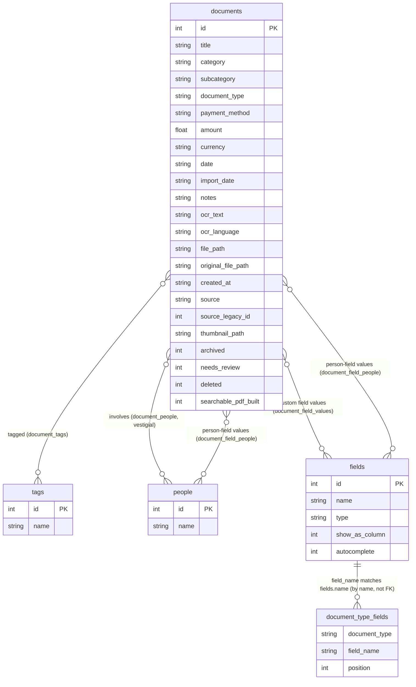

# Dossiary

*[Diese Anleitung auf Deutsch lesen](README.de.md)*

**New here? Start with the [User Guide](USER_GUIDE.md) instead** — this
README covers the technical internals (schema, architecture, testing).

A local-first, browser-based document archive: capture, OCR, tag, and browse
your own documents — no server, no account, no upload. Everything lives in
one SQLite database and a folder of files on your own disk, opened and
written directly by the browser.

## Why

Most document-management tools want your files in their cloud. Dossiary
is the opposite: it's a single HTML file that reads and writes a
folder you choose, using the browser's
[File System Access API](https://developer.mozilla.org/en-US/docs/Web/API/File_System_API)
and [sql.js](https://github.com/sql-js/sql.js) (SQLite compiled to
WebAssembly) — nothing is ever uploaded anywhere. Point it at a folder,
and that folder *is* your archive.

It also has no native-code dependency of any kind, so it runs identically on
Apple Silicon or Intel, macOS/Windows/Linux — anywhere a modern Chromium
browser runs — indefinitely, with no risk of the "Intel-only app stops
working" problem that motivated this project in the first place.

## Features

- **Recent libraries** — the last 5 libraries you've opened show up on the
  startup screen; click one to reopen it with a single permission-confirm
  click, no need to browse to the folder again. This works by storing the
  folder's access handle in your browser's IndexedDB and re-requesting
  permission on it, not by uploading or copying anything — the data itself
  is never touched until you click. Remove an entry with its ✕ (e.g. on a
  shared computer, or a library you're done with) — there's no separate
  setting to turn this off; removing is the opt-out. Note that on `file://`
  pages, IndexedDB storage is shared across every local file you open in
  the browser, so in principle any other local HTML page you open could
  read a stored library's access handle too — though it would still need
  you to click Allow on a permission prompt naming the real folder.
- **Browse** — sortable, searchable, filterable list of every document in
  the library, with Category/Type/People filters and, for any custom field
  toggled into the generic column system (see "Any single-valued custom
  field can become a table column, a filter, and offer autocomplete"
  below), its own filter dropdown too. Search matches title, category,
  subcategory, document type, notes, OCR text, tags, people, and every
  custom field's value. Amount gets a dedicated **range filter** instead of
  a dropdown (a dropdown of every distinct amount wouldn't be useful) — a
  min and a max number input in the toolbar, either or both optional, plus
  a separate "Amount not set" checkbox for finding documents with no saved
  Amount at all (which disables the min/max inputs while checked, since the
  two are mutually exclusive ways of filtering the same field).
- **Capture** — add a new document (PDF or image), with client-side OCR via
  [Tesseract.js](https://github.com/naptha/tesseract.js) running entirely in
  your browser. Language options: German, English, or both auto-detected
  together, plus single-language French, Spanish, Chinese (Simplified), and
  Chinese (Traditional / Cantonese — Tesseract has no separate Cantonese
  model, since Cantonese text is written with the same traditional-character
  script). For JPEG/PNG images, this also builds a **searchable PDF** — the
  image with an invisible, selectable text layer positioned over each
  recognized word (the same "sandwich" technique tools like `ocrmypdf`
  use) — while the original image is preserved untouched in a subfolder
  next to it, mirroring how Mariner Paperless itself laid out processed
  vs. original files. If you're starting from a paper document, a "Need to
  scan a paper document first?" toggle in the capture form explains how to
  scan it first — Image Capture or Preview on macOS, the Windows Scan app
  on Windows, detected automatically — since a browser has no way to drive
  scanner hardware directly — see Limitations below.
- **Inbox** — a lightweight amber banner appears on opening a library if its
  `inbox/` folder (at the library root, alongside `library.sqlite` and
  `files/`, and created automatically the same way `files/` is — no manual
  setup needed before dropping a file in by hand or pointing `scan_watch.py`
  at it) has any files waiting in it. Click "Add all" (or the toolbar's
  always-visible "📥 Check inbox" button, for anything staged after the
  library's already open) to add every staged file with default values
  (just the file, plus a filename-derived title) — the rest of the metadata
  is left blank for you to fill in from the document's own Edit dialog
  afterward. This pairs with the standalone
  [`scan_watch.py`](#scan_watchpy-watched-folder-helper) script below, which
  moves finished scans from wherever your scan software saves them into that
  `inbox/` folder — Dossiary itself never watches the filesystem or
  writes a document automatically; adding files from the inbox always
  requires this explicit click.
- **Review queue** — a second stage after the Inbox: every document added
  from the inbox (category, type, and date all still blank at that point)
  is automatically flagged "needs review" and shown in the "🚩 Inbox" nav
  item alongside "📁 All Documents" and "🗑 Waste bin," instead of sorting
  to a possibly-unnoticed spot in the main table. Click a queued document to
  open it, then "Edit" to fill in its metadata. Only the explicit "Done"
  button — in the document's own detail view — clears the flag and moves
  it out of the queue; saving an intermediate edit does not, so you can
  save your progress partway through without losing your place in the
  queue. Any document can be flagged this way, not just inbox imports —
  open a document and click "Flag for review" if you want to come back to
  it later. Flagging and archiving are independent: flagging an archived
  document doesn't unarchive it, and vice versa — an archived document
  stays reachable only via "Show archived" in the main table, same as any
  other archived document.
- **Waste bin** — "Delete" on a document doesn't actually destroy anything;
  it just moves the document to the "🗑 Waste bin" (from the toolbar),
  where it stays until you click "Restore" — there is no "empty bin"
  action anywhere, so nothing you delete is ever truly gone. A deleted
  document is hidden everywhere else, including the main table with "Show
  archived" checked and the review queue, and its detail view only offers
  Restore until you do. Files on disk, thumbnails, and the sidecar `.txt`
  are never touched either way.
- **Reports** — a 4th nav view totals your documents by Category, Type,
  People, or any custom field, grouped by currency so amounts in different
  currencies are never added together, with a date-range filter and a
  print-friendly layout for tax season or expense reimbursement.
- **Collections** — organize documents into your own named groupings, reachable from an expandable Collections section in the nav. Manual collections are hand-picked lists (select documents in the table to bulk-add them to a collection, bulk-archive, bulk-delete, or bulk-flag for review, or add one at a time from a document's own detail view); Smart Collections save your current search/category/type/person/field filters as a live view that keeps matching new documents automatically.
- **Spotlight/Finder search** — every captured document also gets a plain
  `.txt` sidecar file (title, category, tags, notes, OCR text, custom
  field values) written next to it, so macOS's built-in file search can
  find documents by fields that otherwise only live inside
  `library.sqlite`. This isn't a real Spotlight *integration* (not
  possible from a browser — see Limitations below); it's just an ordinary
  text file that happens to get indexed like any other.
- **Custom fields, fully generic** — text, number, date, checkbox, and
  person fields (Organization, Year, Date From, Paid, Reimbursable,
  Author, Collaborator — whatever your library uses) are all modeled the
  same way, backfilled from Mariner's own field definitions and values.
  Not a fixed set of hardcoded fields. A person-type field works like
  People itself (see "Tag & organize" below): comma-separated, a document
  can relate to more than one person through it, and every person-type
  field shares the same underlying list of names, so someone typed into
  Author autocompletes and searches the same as one typed into People.
- **Reminders** — give any custom field the `Reminder` type (alongside
  Text/Number/Date/Checkbox/Person) to turn it into a due-date source —
  Renewal Date, Warranty End, Inspection Due, whatever you need, and a
  document can carry more than one. Dossiary checks what's due whenever a
  library opens, and on demand via the toolbar's "🔔 Check reminders"
  button, listing anything due or overdue (soonest/most-overdue first)
  with a per-row snooze — 1 week, 1 month, 3 months, or a custom date —
  for anything you're not ready to handle yet; a snoozed reminder
  resurfaces on its own once the snooze passes, no un-snooze step needed.
  This is checked on demand only — see Limitations below.
- **Quick "Add reminder"** — right-click any document (or use its detail
  view) for a one-click reminder that needs no field configured first:
  Today, Tomorrow, Next week, or a custom date. It's the same `Reminder`
  field type under the hood, via a single reserved field created
  automatically the first time you use it.
- **Tag & organize** — category, subcategory, document type, payment
  method, amount, date, notes, people, custom fields, and free-form tags
  per document — a document can relate to more than one person, filterable
  the same way tags are
- **Open originals** — one click to open the actual file from disk
- **File paths shown in the detail view** — a `File` line (and `Original`,
  for a captured image that got turned into a searchable PDF) showing the
  path relative to your library folder, so you can find it yourself in
  Finder (macOS), File Explorer (Windows), or your file manager (Linux).
  Browsers have no API to reveal a file in the OS's file manager directly
  or expose its absolute path, so this is as close as the app can get.
- **Edit** — click any document, then "Edit" to update its metadata (title,
  category, subcategory, type, payment method, amount, date, people, tags,
  custom field values, notes, OCR text) after the fact. This only ever
  changes `library.sqlite` — the underlying file on disk is never touched
  or replaced.
- **Configurable columns & filters** — the "⚙ Columns" button in the
  toolbar lets you show/hide table columns (Category, Type, Payment method,
  People, Date, Imported, Amount, Tags); each one that supports filtering
  shows or hides its matching filter dropdown at the same time. The choice
  is saved in `library.sqlite` itself, so it travels with the library
  folder rather than being tied to one browser or device. Any custom field
  flagged to show as a column also gets its own filter dropdown here, the
  same way the built-in fields do.
- **The table header stays visible while scrolling** — useful once a
  library has enough documents that the list genuinely scrolls. The
  document list itself is a bounded, independently-scrolling area (not
  the whole page), so column headers (and the ability to click one to
  sort) are always in reach no matter how far down the list you are.
- **Document previews** — every document can show a small preview image in
  its detail view. Migrated documents get Mariner's own thumbnail, copied
  over directly by `migrate_to_new_library.py`. Newly captured documents
  get one generated automatically (an image gets downscaled directly; a
  PDF gets its first page rendered via [pdf.js](https://mozilla.github.io/pdf.js/)).
  A "Generate preview" / "Regenerate preview" button in the detail view
  lets you create one on demand for any document that's missing one, or
  refresh an existing one.
- **Dynamic fields per document type** — capture/edit forms only show the
  custom fields (and People) actually configured for whatever document
  type you've picked, in the configured order, mirroring how Mariner
  Paperless itself decided which fields to display per type. An
  unconfigured document type (a brand new type, or a library where this
  wasn't tracked) shows none of its custom fields at all — matching
  Mariner's own behavior, where fields have to be explicitly assigned to
  a type before they show up.
- **Date defaults to today when capturing** — since that's right for a
  freshly-received document but wrong for a backlog of older mail, it's
  visually flagged (amber-tinted, with a "double-check this" note) until
  you actually touch the field, so an unreviewed guess doesn't quietly
  pass for a real value.
- **Clear button on every datalist field, plus Amount and Currency** — a
  small "✕" on Category, Subcategory, Document Type, Payment method,
  People, Tags, Amount, and Currency, in both capture and edit forms,
  clears that one field and refocuses it — for the datalist-backed fields,
  this pops the full list of existing values back up instead of staying
  filtered to whatever was typed before, handy when you want to pick a
  different value from the list rather than retype one.
- **Re-run OCR on an existing document** — the Edit dialog has its own
  "Run OCR" button, refreshing just the OCR text field against the
  document's actual saved file. Unlike the capture form (images only),
  this works on PDFs too — the majority of saved documents — by rendering
  the first page to an image first.
- **Document Type is placed prominently, near the top of both forms** —
  since it's the one field that determines whether Organization, People,
  or any custom fields show up at all (see "Dynamic fields per document
  type"), it's deliberately not just another field in the middle of the
  form. Pick it first, then everything below reflects that choice.
- **Field settings** — the "⚙ Manage fields" button opens a dialog for
  managing which fields show per document type (and in what order), plus
  a default document type and a default currency that pre-fill the Add
  Document form (see "Amount has a linked Currency field" below), plus two
  per-field checkboxes — **Column** and **Autocomplete** (see below) —
  available for any real custom field. Mirrors Mariner Paperless's own
  Document Types / Fields / Display Fields screen: pick a type on the
  left, add fields to it from the middle column, reorder or remove them on
  the right — changes save immediately. Deliberately scoped to document
  types already in use (a brand new type comes into existence by typing it
  into the Add/Edit form, not from this dialog), and to toggling/reordering
  *existing* custom fields — it doesn't create new ones from scratch (see
  below for where that happens instead). **Payment method is a completely
  ordinary custom field** — despite being a mandatory, always-present field
  in Mariner itself, there's no reason for a general-purpose tool to keep
  it as a hardcoded special case, so it's just one more row in the Fields
  list: toggleable per document type, reorderable, and (see below)
  column/filter/autocomplete-able exactly like anything else. Amount keeps
  a small, deliberate exception — see "Amount has a linked Currency field."
  Reclassifying a document to a type where a field isn't configured never
  discards the value already saved — it's just not shown until you either
  add the field back for that type or reclassify again. The detail view's
  header reflects this too: Payment and Amount only appear there when a
  document actually has a value for them, rather than always showing an
  empty placeholder.
- **Any single-valued custom field can become a table column, a filter, and
  offer autocomplete** — two checkboxes next to each field in Field
  Settings' Fields list (not offered for person-type fields like People,
  Author, or Collaborator — see Limitations). **Column** adds a sortable
  table column (click its header
  to sort, numerically for Number-type fields) and, for Text/Checkbox
  fields, a toolbar filter dropdown built from the real distinct values
  already in your library — Number/Date fields get the column without a
  filter dropdown, the same way the built-in Date and Amount columns
  already work, since a dropdown listing every distinct number or date
  isn't useful. **Autocomplete** (Text fields only) offers previously-used
  values while typing — the same underlying mechanism Payment method
  itself now uses. Both start off for a newly created field, so a fresh
  custom field doesn't clutter the table or toolbar until you decide it's
  worth surfacing there.
- **Any field can carry a short description** — Field Settings' "Field
  Descriptions" section lists every field, built-in (Category, Subcategory,
  Document Type, Date, Tags) and custom alike, each with its own optional
  text. Useful for a field whose name alone doesn't say enough — e.g.
  clarifying that "Organization" can hold a person's name too, not just a
  company's. Once set, it shows as a small hint line under the field's
  label in both the capture and edit forms; a field with nothing set shows
  no hint at all. Document Type is the one field that already had its own
  built-in hint ("Not in the list? Type a new one — it'll be created.") —
  adding a description there shows both, stacked, rather than replacing
  the original.
- **Add a custom field right from the capture/edit forms** — a
  "+ Add a custom field" toggle below the custom fields, hidden until you've
  entered a document type (a field always has to attach to *some* type).
  Pick a name and a type (Text/Number/Date/Checkbox/Person — no Currency
  option; for a monetary value use the built-in Amount field instead, which the
  form reminds you of), and it's created and immediately shown on the
  document you're filling out — no trip to Field Settings required, and no
  document type needed there in advance either, which matters for a
  library that's never had a custom field at all (nothing pre-migrated
  from Mariner, and nothing created yet). Adding a field this way never
  disturbs anything already typed into the document's *other* fields — a
  real risk that was deliberately designed around, not just tested for; a
  naive implementation that simply re-rendered the whole custom-fields area
  would have silently discarded whatever was already filled in. A name
  that's already in use is rejected rather than silently attached to the
  current type or duplicated — use Field Settings (which already lists
  every existing field) for that instead.
- **Amount has a linked Currency field** — both are ordinary custom fields
  under the hood now (their capture/edit form inputs are two normal,
  independently-positioned fields, each with its own clear button). Amount
  alone keeps one deliberate exception from the fully generic system above:
  it never gets Column/Autocomplete checkboxes in Field Settings, and its
  *table column and detail-view line* always stay combined with Currency
  into one "123.45 EUR" display (amount, then currency, consistently)
  rather than becoming its own column — sorting that combined Amount column
  sorts by the raw number only, and there's no currency conversion, since
  this is a personal document archive, not an accounting tool. **Currency
  itself is a completely ordinary custom field, same as Payment method** —
  it gets its own optional table column, toolbar filter dropdown (listing
  every distinct currency actually used in your library, plus "— Not set
  —"), and autocomplete, toggleable via Field Settings' Column/Autocomplete
  checkboxes exactly like any other text field, entirely independent of the
  combined Amount/Currency display above (that display keeps working
  unchanged whether or not Currency's own column happens to be toggled on).
  Currency's autocomplete draws from currencies already used in the
  library rather than a fixed dropdown, since real documents mix symbols
  like "€"/"$" and codes like "EUR"/"USD", and free text makes it
  impossible to know whether a given value is meant as a prefix symbol or a
  suffix code. A **default currency**, set once in Field Settings, is
  optional and unset by default — when configured, it pre-fills new
  captures' Currency field the same way the Date field pre-fills to today:
  visually flagged as a guess (amber, with a "double-check this" hint)
  until you actually touch the field. It's a per-library setting, not a
  hardcoded assumption, since Dossiary is a general-purpose,
  single-file, downloadable tool — a fixed default would just be silently
  wrong for anyone whose library isn't in that one currency. Editing guesses
  too, but only for a document that already has a real amount and no
  currency saved — e.g. one captured before a default currency was ever
  set — so that gap can actually be closed rather than requiring the
  Currency to be retyped from scratch. Any other blank Currency in Edit
  (no amount, or an amount of zero) is left alone: that's the document's
  real, saved state, not something to guess at.
- **Editing never hides data behind a configuration change** — if a
  document has a value in a field that isn't (or is no longer) configured
  to display for its current type — reclassified, or the field got
  removed from that type's setup in Field Settings — the Edit dialog
  still shows it, appended after the normally-configured fields and
  visually marked ("Not shown for this document type"), so you always
  have the chance to review, fix, or clear it. It just won't appear again
  once cleared, or once you change the document's type to something that
  doesn't include it and don't touch it.
- **English/German interface** — the whole UI (not just OCR — see
  "Capture" above) can be switched between English and German with the
  toggle in the footer; it starts by matching your browser's own
  language and remembers whichever you pick from then on.

## Getting started

1. Open `dossiary.html` directly in **Chrome or Edge** (double-click
   it, or drag it into a browser window — don't use an embedded preview
   pane; folder write access requires a real top-level page).
2. Click **"Open library folder"** and choose a folder. If it's empty,
   you'll be offered to initialize a new library there. If it already has a
   `library.sqlite` (e.g. from a migration — see below), it opens straight
   into your existing documents.
3. Click **"＋ Add document"** to capture something new.

### Installing it as an app (currently unavailable)

Chrome and Edge both have a feature that turns a page you have open into
something that looks and launches like a native app — its own icon and
window, no tabs or address bar. This used to work for a file opened
directly from disk, but current versions of both browsers restrict it to
pages served from a real `http://`/`https://` origin — opening
`dossiary.html` directly (`file://...`) greys out both **Create
Shortcut…** (Chrome) and **Install this site as an app** (Edge), confirmed
in both browsers. This is a browser platform restriction on the `file://`
protocol itself, not a bug in this app or something a manifest could fix.

Opening the file directly in a regular browser tab works exactly the same
either way — this was always just a cosmetic convenience, never required.
If you want the "own window" look badly enough to work around it, the only
real option is serving the file over `http://` instead of opening it
directly (e.g. `python3 -m http.server` from the library's folder, then
opening `http://localhost:8000/dossiary.html`) — but that reintroduces
exactly the "needs a server" step this project exists to avoid, so it's
not something recommended here by default.

### Coming from another tool?

If you're migrating from the discontinued Mariner Paperless app, see
[MIGRATION.md](MIGRATION.md) for the conversion tools and steps.

### scan_watch.py (watched-folder helper)

A small standalone Python script (stdlib only — no `pip install` needed) that
watches a folder your scan software saves finished scans into (e.g. ScanSnap
Home's own "save to folder" destination) and moves each stabilized file into
a Dossiary library's `inbox/` folder, for the in-app Inbox feature
described above to pick up:

```
python3 scan_watch.py --drop-folder ~/Scans --library ~/Documents/MyLibrary
```

It runs continuously by default (checking every `--poll-interval` seconds,
default 2), or once with `--once`. A file is only moved once it hasn't been
modified for `--settle-seconds` (default 2), so a scan still being written
isn't grabbed mid-write.

This is deliberately filesystem-only — it never touches `library.sqlite`
itself, doesn't assign document IDs, and doesn't set any metadata. Dossiary
is the library's sole writer to `library.sqlite` (it loads the whole
database into memory in the browser tab and only writes it back out on an
explicit save), so a second process inserting rows directly could silently
lose work to whichever side saved last. Keeping this script to "just move
the file" sidesteps that risk entirely, and means nothing is ever added to
your archive without an explicit click inside the app itself, in keeping
with Dossiary's own "no silent writes" design (documents are only
ever written from something you clicked, not from data arriving on disk on
its own).

## Database schema



`document_type_fields.document_type` and `documents.document_type` match by
plain-text name, not a SQLite foreign key — like `category`/`subcategory`/
`payment_method` on `documents` itself, this schema stores resolved names
directly as `TEXT` rather than keeping separate lookup tables, so there's
nothing left to declare a real foreign key against. `document_field_people`
is genuinely a three-way relationship (document × field × person), shown
above as two separate binary lines for legibility rather than as its own
box. `document_people` is vestigial — see below. `settings` isn't shown
here since it's a plain key-value table with no relationships to anything
else; see its own description below.

The diagram above is a relational overview; the full column-by-column
listing (types, defaults, and the reasoning behind vestigial/nullable
columns) follows:

```
documents
    id                  INTEGER PRIMARY KEY
    title               TEXT
    category            TEXT
    subcategory         TEXT     -- independent of category, NOT a child of it (see note below)
    document_type       TEXT
    payment_method      TEXT     -- VESTIGIAL -- see "fields"/"document_field_values"
    amount              REAL     -- below. Neither read nor written anymore; kept
    currency            TEXT     -- (never dropped) so old bytes aren't destroyed.
    date                TEXT     -- ISO 8601, the document's own date (e.g. invoice date)
    import_date         TEXT     -- ISO 8601, when the document was scanned/captured/imported
                                  -- (for migrated documents, this comes from Mariner's own
                                  -- import date; for captured documents, it equals created_at)
    notes               TEXT
    ocr_text            TEXT
    ocr_language        TEXT     -- 'deu' / 'eng' / 'eng+deu' / NULL
    file_path           TEXT     -- relative to library root, e.g. "files/3_invoice.pdf"
    original_file_path  TEXT     -- relative to library root; now set for every new
                                  -- document (Inbox or capture), not just searchable PDFs
    searchable_pdf_built INTEGER -- 0/1, default 0; whether Dossiary's own OCR+jsPDF
                                  -- pipeline built the file currently at file_path --
                                  -- original_file_path's presence alone no longer means this
    created_at          TEXT     -- ISO 8601, when the record was created
    source              TEXT     -- 'migrated', 'captured', or 'scan-inbox'
    source_legacy_id    INTEGER  -- traceability only, for migrated documents
    thumbnail_path      TEXT     -- relative to library root, nullable
    archived            INTEGER  -- 0/1, default 0; reversible "no longer needed" flag,
                                  -- hidden from the default view -- see Features above
    needs_review        INTEGER  -- 0/1, default 0; "not yet reviewed" flag, shown in the
                                  -- review queue instead of the main table -- see Features above
    deleted             INTEGER  -- 0/1, default 0; soft-delete flag, reachable only from the
                                  -- Waste bin -- see Features above. No file/thumbnail/sidecar
                                  -- is ever touched, and there's no "empty bin" purge feature.

tags
    id    INTEGER PRIMARY KEY
    name  TEXT UNIQUE

document_tags
    document_id  INTEGER
    tag_id       INTEGER
    PRIMARY KEY (document_id, tag_id)

people
    id    INTEGER PRIMARY KEY
    name  TEXT UNIQUE

document_people
    document_id  INTEGER      -- VESTIGIAL -- see "fields"/"document_field_people" below.
    person_id    INTEGER      -- Neither read nor written anymore; kept (never dropped)
    PRIMARY KEY (document_id, person_id)   -- so old bytes aren't destroyed.

settings
    key    TEXT PRIMARY KEY
    value  TEXT

fields
    id                INTEGER PRIMARY KEY
    name              TEXT UNIQUE
    type              TEXT      -- 'text', 'number', 'date', 'checkbox', 'person', or 'reminder'
    show_as_column    INTEGER   -- 0/1; adds a sortable table column, and (text/
                                  -- checkbox types only) a toolbar filter dropdown.
                                  -- Not offered for 'person'-type fields (see below).
    autocomplete      INTEGER   -- 0/1; text-type fields only -- offers previously-
                                  -- used values while typing

document_field_values
    document_id  INTEGER
    field_id     INTEGER
    value        TEXT     -- always stored as text; interpreted per fields.type when read.
    PRIMARY KEY (document_id, field_id)   -- Not used for 'person'-type fields -- see below.

document_field_people
    document_id  INTEGER
    field_id     INTEGER  -- a `fields` row of type 'person' -- People, Author, Collaborator, ...
    person_id    INTEGER
    PRIMARY KEY (document_id, field_id, person_id)

document_type_fields
    document_type  TEXT
    field_name     TEXT      -- a name from `fields` -- includes 'People' itself now, not
                              -- just custom fields (see below)
    position       INTEGER   -- display order within this document type
    PRIMARY KEY (document_type, field_name)
```

`settings` is a small key-value table for app preferences that should
travel with the library rather than live in browser storage — currently
`visible_columns` (a JSON array of which table columns and their
matching filters are shown), `default_document_type` (pre-fills the Add
Document form's Document Type field), and `default_currency` (pre-fills
new captures' Currency field as a dismissible guess — see Features above;
unset by default, since this is a general-purpose tool with no currency
that's correct to assume for everyone).

**Custom fields are fully generic** (`fields` + `document_field_values` for
single-valued types, `fields` + `document_field_people` for `person`-type
fields) — Organization, Year, Date From, Paid, Payment method, Amount,
Currency, People, Author, Collaborator, whatever your library actually
uses. Each field has a type (`text`/`number`/`date`/`checkbox`/`person`/
`reminder`) that determines how it's rendered and how its value gets interpreted,
plus the `show_as_column`/`autocomplete` capability flags described above
(not offered for `person`-type fields — a multi-valued field doesn't fit
a single table cell or a useful filter dropdown the way a single-valued
one does). Populated by `migrate_to_new_library.py` from Mariner's own
field definitions and real values for migrated libraries, and by two
one-time, idempotent migrations run on every library open:
`migrateSentinelFieldsToGeneric()` for Payment method/Amount/Currency,
and `migratePeopleToGenericField()` for People itself — both promote what
used to be a hardcoded special case (dedicated `documents` columns for
the former, the singleton `document_people` table for the latter) into
ordinary `fields` rows, copying across any value already saved under the
old shape. New fields, including new `person`-type fields, can also be
created directly from the capture/edit forms (a "+ Add a custom field"
toggle) — see Features above.

`document_type_fields` drives the capture/edit forms' dynamic field
behavior (see "Dynamic fields per document type" above): for a document
type present in this table, only the listed fields — People included,
since it's an ordinary field name here now, not a special case — show,
in the given order. A type absent from this table shows **none** of its
custom fields at all, matching Mariner's own behavior (fields must be
explicitly assigned to a type before they display). Populated by
`migrate_to_new_library.py`, which decodes Mariner's own per-type
display-field configuration; its `'People'` rows needed no migration of
their own when People was promoted to a real field, since the column
already stored that literal string and keeps matching unchanged.

Any `person`-type field (People, Author, Collaborator, ...) works like
tags: a document can relate to more than one person through it (a joint
bill, co-authors, a shared appointment, etc.), so it's a many-to-many
relationship (`document_field_people`, keyed by which field as well as
which document), not a single string value — and every person-type field
shares the same underlying `people` table, so a name typed into Author
autocompletes and searches the same as one typed into People. For
migrated documents, People specifically is backfilled from Mariner's
"Person" custom field — which sometimes held multiple names joined with
"&" (e.g. "Arne & Jana") — split into individual people so that filtering
by one name finds every document they're part of, not just ones where
they're the *only* name. That "&"-splitting only ever happened once,
historically, in `migrate_to_new_library.py`'s own migration step; within
the app itself, every person-type field has only ever used comma-separated
input.

`subcategory` is despite its name **not** nested under `category` — that's
how Mariner's own schema worked (no foreign key between the two tables),
and it holds in the data too: the same subcategory name shows up under
different categories on different documents (e.g. "Dentist" appears under
both "Medical" and "Health"). It's carried over as-is: a second, independent
classification field.

Unlike People, **most custom fields are plain values, not split on "&".**
Person is genuinely multi-valued in practice ("Arne & Jana" means two
people); most other fields aren't — a real "Organization" value can
legitimately contain "&" as part of one name (e.g. "Dres. Ernestus & Cop,
Sandhausen", a German medical practice partnership; "Stadtwerke Walldorf
GmbH & Co. KG"), and splitting on it would corrupt the name rather than
separate genuinely distinct values.

## Limitations

- **No real Spotlight/Core Spotlight integration.** A browser-based app has
  no access to `CSSearchableIndex` or the ability to register a Spotlight
  importer — both require native code installed at the system level. The
  `.txt` sidecar files get *incidental* Spotlight benefit (since Spotlight
  indexes any plain text file's content), but this is a workaround, not a
  true integration, and it doesn't cover PDFs without a text layer.
- **No direct scanner integration.** A browser has no API to drive scanner
  hardware or launch a native app like Image Capture or Windows Scan — the
  capture form's "Need to scan a paper document first?" toggle only offers
  instructions (tailored to your OS — Image Capture/Preview on macOS,
  Windows Scan on Windows, a generic pointer elsewhere) for scanning outside
  the app and then picking the resulting file with the normal file picker;
  it can't trigger a scan itself. For a more
  automated "scan → shows up ready to review" workflow, see the Inbox
  feature and [`scan_watch.py`](#scan_watchpy-watched-folder-helper) above
  — that still requires an explicit in-app click to actually add each file
  as a document, by design.
- **Reconnecting a recent library still needs one click.** Browsers won't
  let a page silently regain filesystem access after a reload — even with
  a library remembered in the Recent libraries list (see Features above),
  reopening it takes one explicit click to re-confirm permission. This is
  a browser security requirement, not something Dossiary can skip.
- **Searchable PDF generation works on JPEG/PNG images captured directly,
  not PDF uploads.** Building the invisible, selectable text layer
  requires the *source* to be an image jsPDF can embed; a PDF you upload
  during capture is saved as-is, with no text layer added at capture
  time. This is distinct from OCR *text extraction*, which does work on
  PDFs — see "Re-run OCR" above — it just doesn't turn the PDF itself
  into a new, searchable one; the extracted text only fills the OCR text
  field. Other image formats (WEBP, GIF, TIFF) are similarly OCR'd for
  extracted text but not turned into a searchable PDF, since jsPDF's
  image embedding is only used here with JPEG/PNG.
- **Searchable PDF text positioning is best-effort.** Word bounding boxes
  come directly from Tesseract; horizontal stretching to exactly match each
  word's width isn't attempted (only position and approximate font size
  are), so the invisible text layer may not align pixel-for-pixel with the
  visible word underneath on close inspection — it should still select and
  search correctly.
- **Preview generation only covers images and PDFs.** Other file types
  (if you ever capture something else) won't get a preview — "Generate
  preview" will just report it can't handle that format.
- **Field Settings itself still doesn't create new custom fields.** The
  "⚙ Manage fields" dialog only lets you toggle/reorder which *existing*
  fields show per document type. Creating a brand-new field from scratch
  is done from the capture/edit forms instead — see "Add a custom field
  right from the capture/edit forms" above.
- **Person-type custom fields (Author, Collaborator, etc.) can't become
  table columns or filters.** People itself keeps its own permanently-fixed
  table column and filter dropdown, but that's a separate, older mechanism
  — the generic `show_as_column`/`autocomplete` system every other custom
  field can opt into doesn't support multi-valued fields yet (rendering
  several names in one cell, or building a useful filter from them, is a
  distinct feature that hasn't been built). A new person-type field is
  fully usable everywhere else — capture, edit, detail view, search — just
  not as a column or filter.
- **No push notifications or background reminder checking.** Reminders are
  checked only when a library opens, or when you click "Check reminders" —
  a static, single-page app with no server has no way to run code, or wake
  a browser tab, while it isn't open. This is the same "no silent,
  automatic work" principle behind Inbox's own "Check inbox" button above,
  applied to a read-only check instead of a write.
- **Requires Chrome or Edge.** Safari and Firefox don't support the write
  side of the File System Access API as of writing.
- **Needs network on first load** (to fetch the sql.js, Tesseract.js,
  jsPDF, and pdf.js WebAssembly/JS bundles from their CDNs) even though
  your documents never
  leave your machine.

## License

MIT — see [LICENSE](LICENSE).

## Development

There's a real, runnable Playwright regression suite in `tests/` (66
scripts, no real user data — every test seeds its own synthetic library
state). Each is standalone: `cd tests && python3 test_<name>.py`. See
`CLAUDE.md`'s "How this was tested" section for what's covered and how
the stubbing approach works, if you're making changes and want to verify
them the same way. See [CONTRIBUTING.md](CONTRIBUTING.md) for more.

## Third-party libraries

Dossiary itself has no dependencies to install — everything below is
loaded from a CDN at runtime, only when a feature that needs it is actually
used (OCR, generating a searchable PDF, or rendering a PDF page for a
preview/OCR). None of it ever touches your documents except locally, in
your own browser.

| Library | Used for | License |
|---|---|---|
| [sql.js](https://github.com/sql-js/sql.js) | Reading/writing `library.sqlite` (SQLite compiled to WebAssembly) | MIT |
| [Tesseract.js](https://github.com/naptha/tesseract.js) | OCR text extraction | Apache-2.0 |
| [jsPDF](https://github.com/parallax/jsPDF) | Building the searchable PDF layer for captured images | MIT |
| [pdf.js](https://github.com/mozilla/pdf.js) | Rendering a PDF's first page (for previews and OCR) | Apache-2.0 |

Same in-app, via the "Libraries" link in the footer.
