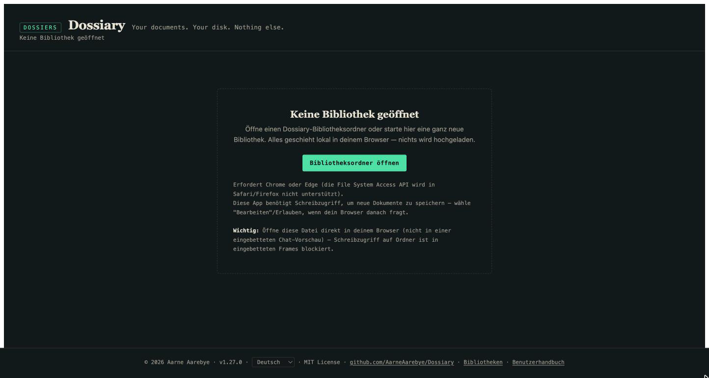
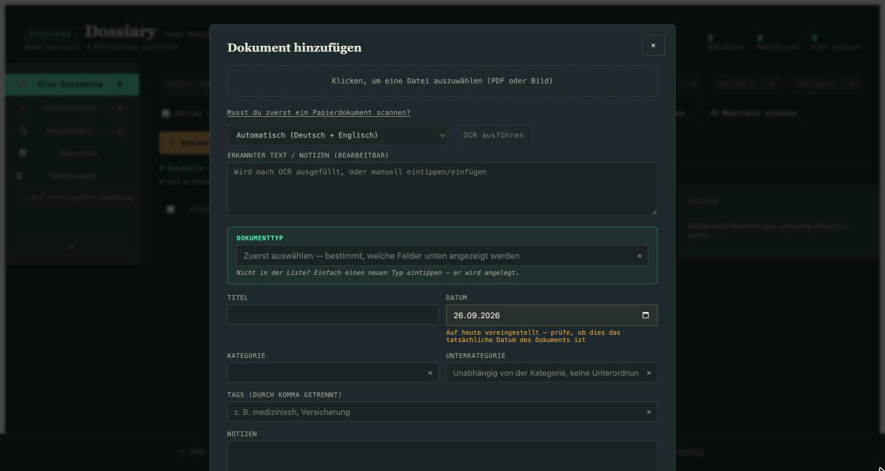
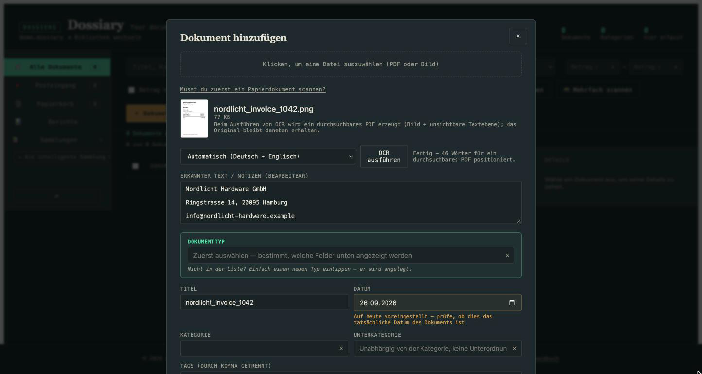
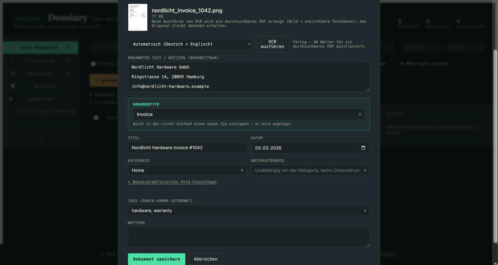
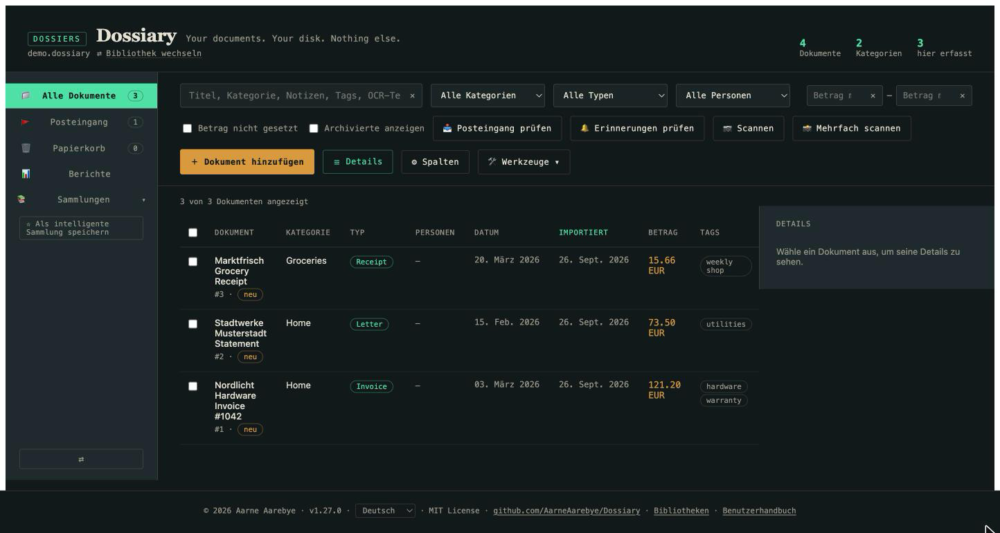
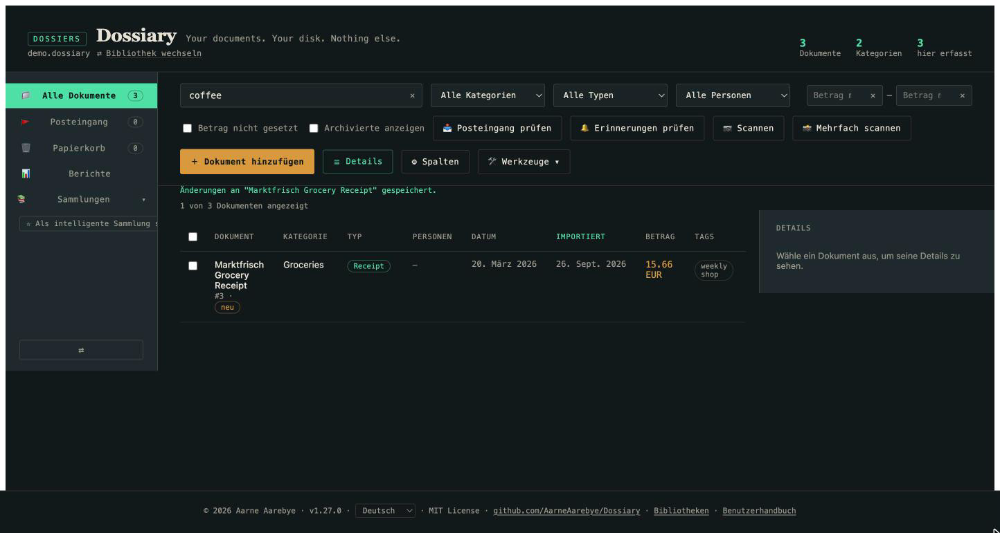
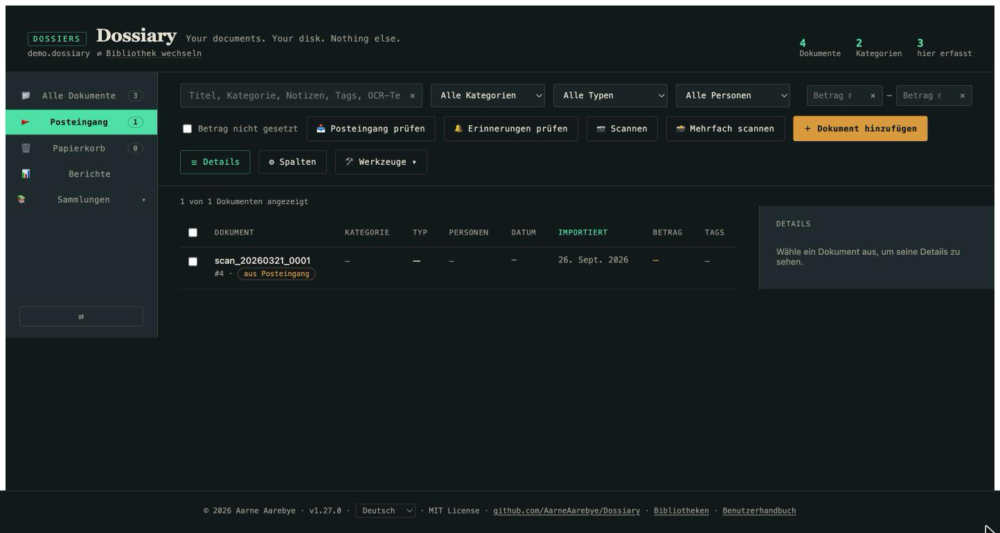
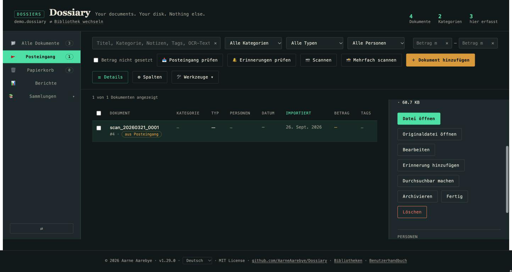
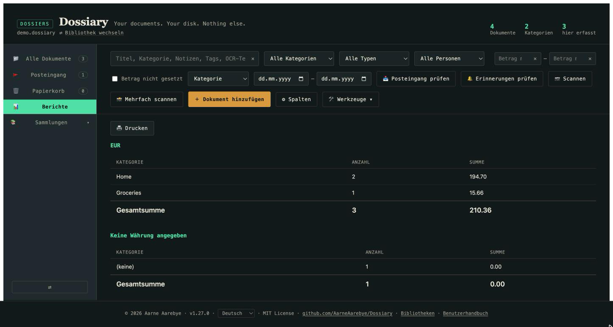

# Dossiary Benutzerhandbuch

*Neu bei Dossiary? Dann bist du hier richtig. Suchst du die technischen
Details — Datenbankschema, Migrationsinterna, Testaufbau? Dann findest du
sie in der [README.md](README.md) (English) bzw. [README.de.md](README.de.md).
Diese Anleitung ist bewusst nicht-technisch gehalten.*

*[This guide in English](USER_GUIDE.md) · [Esta guía en español](USER_GUIDE.es.md) · [Ce guide en français](USER_GUIDE.fr.md) · [简体中文版](USER_GUIDE.zh-Hans.md)*

## Was ist Dossiary?

Dossiary ist ein privates, persönliches Dokumentenarchiv. Du scannst oder
fotografierst deine Papierdokumente — Rechnungen, Briefe, Kassenbons,
Verträge, alles, was sonst in einer Schublade landen würde — und Dossiary
hält sie organisiert, durchsuchbar und lesbar, dauerhaft.

Ein paar Dinge unterscheiden Dossiary von einer typischen
"Dokumentenverwaltungs-App":

- **Es ist einfach nur eine Datei.** Eine einzige `dossiary.html`-Datei,
  einmal heruntergeladen. Keine Installation, kein Konto, kein Abo.
- **Nichts verlässt deinen Computer.** Es gibt keinen Server, keine
  Cloud, keinen Upload. Alles läuft in deinem Browser und liest/schreibt
  direkt in einen Ordner, den du selbst auf deiner eigenen Festplatte
  auswählst.
- **Du behältst deine Daten, auch wenn du die App nicht mehr benutzt.**
  Deine Bibliothek ist ein ganz normaler Ordner mit Dateien (eine kleine
  Datenbankdatei plus deine Originaldokumente), den du wie jeden anderen
  Ordner öffnen, kopieren oder sichern kannst.

Klingt das interessant? Der Rest dieser Anleitung zeigt dir, wie du die
App tatsächlich benutzt.

## Erste Schritte

1. **Lade `dossiary.html` herunter** aus dem
   [GitHub-Repository](https://github.com/AarneAarebye/Dossiary) und öffne
   die Datei in Chrome oder Edge (einer dieser beiden Browser wird
   benötigt — Safari und Firefox unterstützen die zugrunde liegende
   Technik nicht, mit der die App auf deiner Festplatte liest und
   schreibt).
2. Du siehst zunächst den Bildschirm "Keine Bibliothek geöffnet". Das ist
   normal — das ist das Allererste, was du siehst, bevor du einen Ordner
   für dein Archiv ausgewählt hast.

   

3. Klicke auf **Bibliotheksordner öffnen** und wähle (oder erstelle) einen
   leeren Ordner irgendwo auf deinem Computer — dieser wird zu deiner
   Dokumentenbibliothek. Dein Browser fragt nach der Erlaubnis, diesen
   Ordner lesen und beschreiben zu dürfen; erlaube das, denn genau so
   speichert Dossiary deine Dokumente.
4. Da der Ordner leer ist, bietet Dossiary an, ihn als brandneue
   Bibliothek einzurichten. Klicke auf **Eine neue Bibliothek hier
   initialisieren**. Dossiary legt eine kleine Datenbankdatei und ein
   paar Ordner darin an — das ist der gesamte Fußabdruck. Sonst wird
   nichts auf deiner Festplatte verändert.
5. Danach hast du eine leere, einsatzbereite Bibliothek — bereit für dein
   erstes Dokument.

Wenn du Dossiary das nächste Mal benutzen willst, öffne einfach wieder
`dossiary.html` — die App merkt sich diese Bibliothek und bietet dir an,
sie mit einem Klick erneut zu öffnen.

## Dein erstes Dokument hinzufügen

Klicke auf **+ Dokument hinzufügen**. Das öffnet das Erfassungsformular:

1. Klicke auf das gestrichelte Feld oben und wähle eine Datei aus — ein
   Foto oder einen Scan deines Dokuments (JPEG/PNG) oder ein PDF. (Falls
   du es noch nicht gescannt hast, gibt dir der Link "Musst du zuerst ein
   Papierdokument scannen?" kurze Hinweise für die integrierten
   Scan-Werkzeuge deines Betriebssystems.)
2. Sobald eine Datei ausgewählt ist, klicke auf **OCR ausführen**. Das
   liest den Text aus dem Bild heraus, damit er später durchsuchbar ist —
   Dossiary erkennt standardmäßig sowohl Deutsch als auch Englisch
   (weitere Sprachen sind ebenfalls auswählbar). Das dauert nur ein paar
   Sekunden; der erkannte Text erscheint danach im Feld darunter und
   lässt sich bearbeiten, falls die OCR etwas falsch erkannt hat:

   

3. Fülle den Rest aus: wähle oder tippe einen **Dokumenttyp** (Rechnung,
   Brief, Kassenbon — was auch immer passt; neue Typen werden einfach
   durch Eintippen angelegt), einen **Titel**, das tatsächliche **Datum**
   des Dokuments, eine **Kategorie** und beliebige **Tags**, nach denen
   du später filtern möchtest. Nichts davon ist Pflicht außer dem
   Dokumenttyp — fülle nur aus, was für dich nützlich ist.

   

4. Klicke auf **Dokument speichern**. Das war's — dein Dokument ist jetzt
   dauerhaft in deiner Bibliothek, zusammen mit dem erkannten Text.

Wiederhole das für so viele Dokumente, wie du möchtest. Jedes bekommt
seinen eigenen Eintrag in deiner Dokumententabelle:

## Es wiederfinden

Der ganze Sinn der Sache ist, etwas Monate oder Jahre später innerhalb
von Sekunden wiederzufinden. Oben in der Tabelle:

- Die **Suche** durchsucht Titel, Kategorien, Notizen, Tags und den
  per OCR erkannten Text — selbst wenn du nicht mehr weißt, wie du etwas
  genannt hast, findest du es meist, indem du ein Wort eintippst, das
  *auf* dem Dokument stand.
- **Filter** (Kategorie, Typ, Person) grenzen die Tabelle auf genau das
  ein, was passt.
- Klicke auf eine **Spaltenüberschrift**, um danach zu sortieren.

## Der alltägliche Papierstapel

Ein Dokument nach dem anderen über das Formular zu erfassen funktioniert,
aber die meisten Menschen bekommen ihre Unterlagen nicht einzeln — sie
kommen als Stapel oder gehen in einem Rutsch durch den Scanner. Dafür hat
Dossiary einen leichteren Weg: den **Posteingang**.

Jede Bibliothek hat einen `inbox`-Ordner direkt neben deiner
Bibliotheksdatei. Lege gescannte Dateien dort hinein — indem du sie selbst
hineinziehst, über die "In Ordner speichern"-Funktion deines Scanners,
oder (für eine vollautomatische Variante) mit dem mitgelieferten Skript
`scan_watch.py`, das in der technischen README beschrieben ist — und
klicke dann in Dossiary auf **Posteingang prüfen**.

Jede dort wartende Datei wird sofort hinzugefügt, zunächst nur mit einem
aus dem Dateinamen abgeleiteten Titel und sonst nichts ausgefüllt, und
landet in einer Prüfwarteschlange statt direkt in deiner
Hauptdokumentenliste:

Klicke ein Dokument an, um in deinem eigenen Tempo die Details
auszufüllen, die dir wichtig sind (Kategorie, Typ, Tags, Datum), und
markiere es dann als **Fertig** — oder **archiviere** es, oder
**lösche** es, falls sich herausstellt, dass es nichts Aufbewahrenswertes
ist. Nichts wird jemals stillschweigend verworfen; jede dieser Aktionen
lässt sich aus der Detailansicht des Dokuments rückgängig machen.

Das ist die praktische Antwort auf "Wie bekomme ich mein ganzes
Papierarchiv hinein": Alles in Stapeln in den Posteingang scannen und
dann die Prüfwarteschlange abarbeiten, wann immer du ein paar freie
Minuten hast — statt für jedes einzelne gescannte Blatt sofort ein
Formular sorgfältig ausfüllen zu müssen.

## Ein kurzer Rundgang durch alles Weitere

Sobald du mit den Grundlagen oben vertraut bist, gibt es noch mehr, das
sich zu kennen lohnt — jedes davon ist wirklich nützlich, aber nichts
davon ist nötig, um anzufangen, deshalb bleibt dieser Abschnitt bewusst
kurz.

- **Berichte** — Summen gruppiert nach Kategorie, Typ oder Person, mit
  einem Datumsbereichsfilter. Nützlich zur Steuerzeit oder für
  Spesenabrechnungen.

  

- **Sammlungen** — fasse eine Gruppe von Dokumenten zusammen, entweder von
  Hand (auswählen und hinzufügen) oder als "Intelligente Sammlung", die
  automatisch mit deiner aktuellen Such-/Filtereinstellung mitwächst,
  sobald neue Dokumente dazukommen.
- **Archivieren** — eine Markierung für "brauche ich nicht mehr in meiner
  alltäglichen Liste zu sehen, aber nicht löschen", unabhängig vom
  Papierkorb.
- **Papierkorb** — das Löschen eines Dokuments zerstört nichts auf der
  Festplatte; es wandert in den Papierkorb, jederzeit vollständig
  wiederherstellbar (es gibt keinen "Papierkorb leeren"-Button — diese
  App zerstört deine Daten niemals endgültig).
- **Benutzerdefinierte Felder** — über die eingebauten Felder hinaus
  kannst du eigene hinzufügen (Autor, Bezahlt, Erstattungsfähig, was
  auch immer deine Dokumente brauchen), direkt aus dem Erfassungs- oder
  Bearbeitungsformular heraus, pro Dokumenttyp.

## Wie geht es weiter?

- Neugierig, wie Dossiary deine Daten tatsächlich speichert, oder willst
  du die vollständige Liste aller Funktionen samt Sonderfällen sehen?
  Siehe die technische [README.de.md](README.de.md).
- Migrierst du eine alte Mariner-Paperless-Bibliothek? Siehe
  [MIGRATION.de.md](MIGRATION.de.md) — das ist ein einmaliger
  Umwandlungsschritt, den diese Anleitung nicht abdeckt.
