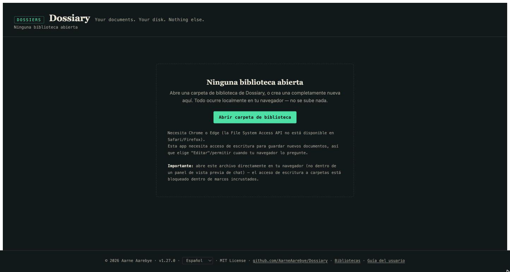
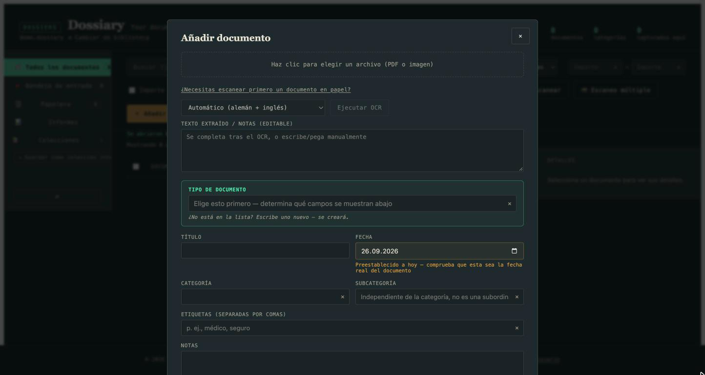
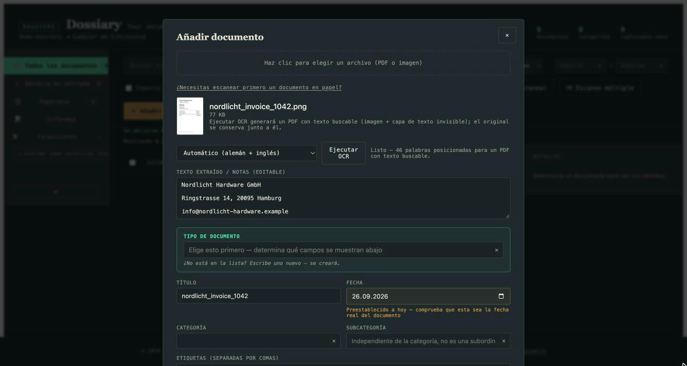
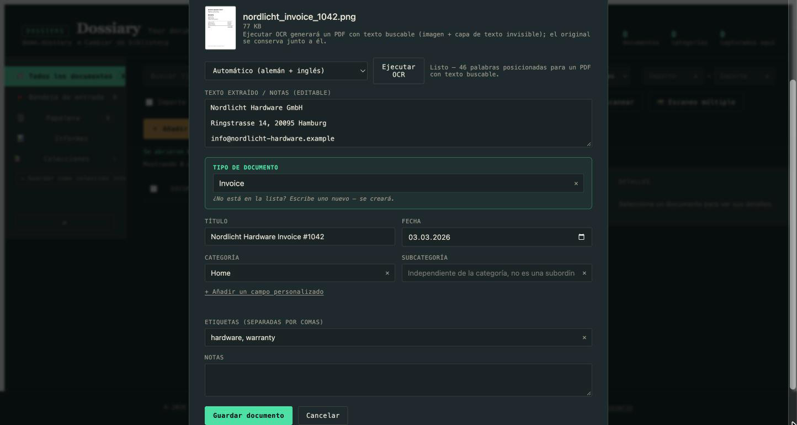
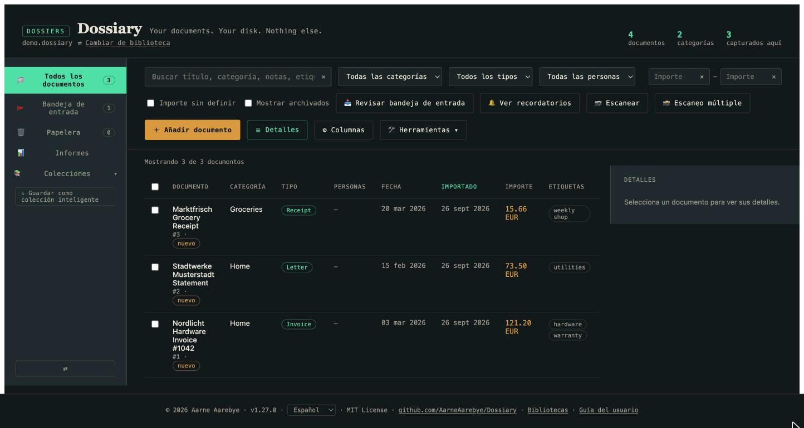
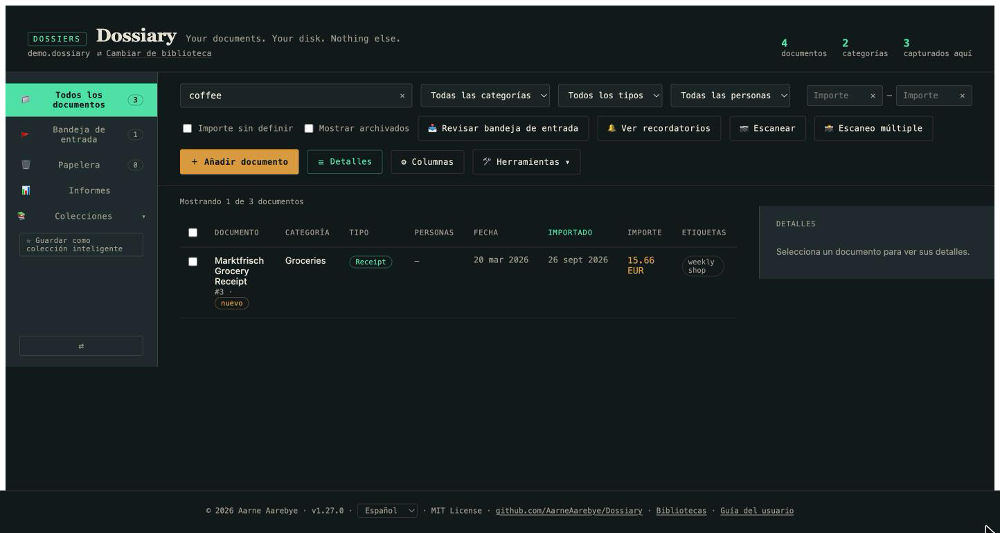
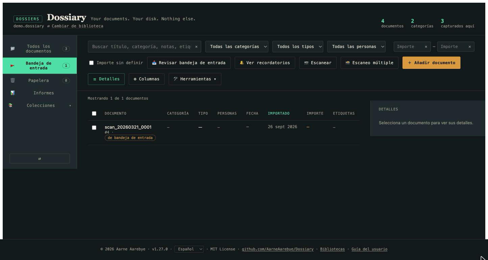
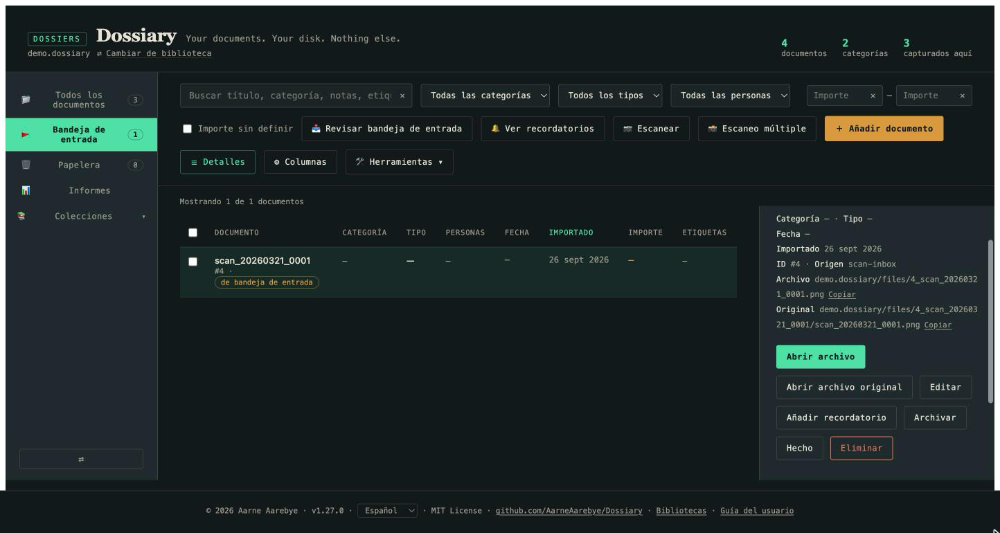
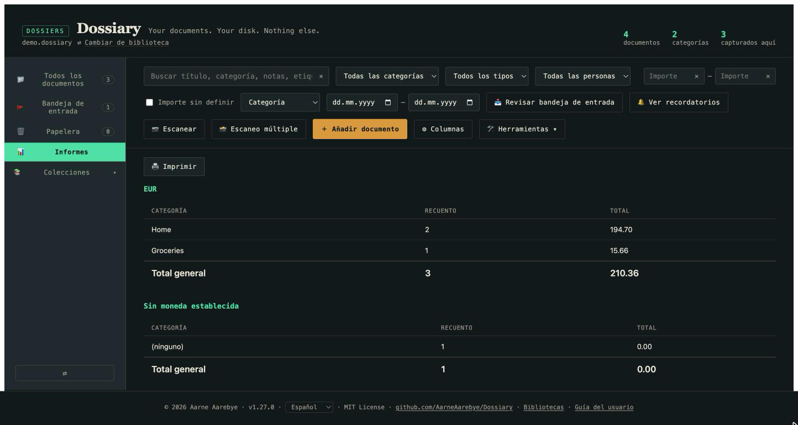

# Guía del usuario de Dossiary

*¿Nuevo en Dossiary? Estás en el lugar correcto. ¿Buscas los detalles
técnicos — el esquema de la base de datos, los detalles de la migración,
la configuración de pruebas? Consulta [README.md](README.md) (en inglés)
o [README.de.md](README.de.md) (en alemán). Esta guía es deliberadamente
no técnica.*

*[This guide in English](USER_GUIDE.md) · [Diese Anleitung auf Deutsch](USER_GUIDE.de.md)*

## ¿Qué es Dossiary?

Dossiary es un archivo de documentos privado y personal. Escaneas o
fotografías tus documentos en papel — facturas, cartas, recibos,
contratos, todo lo que de otro modo acabaría en un cajón — y Dossiary los
mantiene organizados, buscables y legibles, para siempre.

Algunas cosas hacen que Dossiary sea diferente de una "app de gestión
documental" típica:

- **Es solo un archivo.** Un único archivo `dossiary.html`, descargado
  una vez. Sin instalación, sin cuenta, sin suscripción.
- **Nada sale de tu ordenador.** No hay servidor, ni nube, ni subida de
  datos. Todo ocurre en tu navegador, leyendo y escribiendo directamente
  en una carpeta que tú eliges en tu propio disco.
- **Conservas tus datos aunque dejes de usar la app.** Tu biblioteca es
  una carpeta normal con archivos (una pequeña base de datos más tus
  documentos originales) que puedes abrir, copiar o respaldar como
  cualquier otra carpeta.

Si esto te resulta interesante, el resto de esta guía te explica cómo
usar la aplicación en la práctica.

## Primeros pasos

1. **Descarga `dossiary.html`** desde el
   [repositorio de GitHub](https://github.com/AarneAarebye/Dossiary) y
   ábrelo en Chrome o Edge (necesitas uno de estos dos navegadores —
   Safari y Firefox no soportan la tecnología subyacente que la app
   necesita para leer y escribir archivos en tu disco).
2. Verás la pantalla "Ninguna biblioteca abierta". Esto es normal — es lo
   primero que ves antes de elegir una carpeta para tu archivo.

   

3. Haz clic en **Abrir carpeta de biblioteca** y elige (o crea) una
   carpeta vacía en tu ordenador — esta se convertirá en tu biblioteca de
   documentos. Tu navegador te pedirá permiso para leer y escribir en esa
   carpeta; concédelo, ya que así es como Dossiary guarda tus documentos.
4. Como la carpeta está vacía, Dossiary te ofrecerá configurarla como una
   biblioteca completamente nueva. Haz clic en **Inicializar una nueva
   biblioteca aquí**. Dossiary crea un pequeño archivo de base de datos y
   un par de carpetas dentro — eso es todo lo que toca en tu disco.
5. A partir de ahí tienes una biblioteca vacía y lista para usar — lista
   para tu primer documento.

La próxima vez que quieras usar Dossiary, simplemente abre de nuevo
`dossiary.html` — la app recuerda esta biblioteca y te ofrece reabrirla
con un solo clic.

## Añadir tu primer documento

Haz clic en **+ Añadir documento**. Esto abre el formulario de captura:

1. Haz clic en el recuadro punteado de arriba y elige un archivo — una
   foto o escaneo de tu documento (JPEG/PNG), o un PDF. (Si aún no lo has
   escaneado, el enlace "¿Necesitas escanear primero un documento en
   papel?" te da indicaciones rápidas según tu sistema operativo.)
2. Una vez elegido el archivo, haz clic en **Ejecutar OCR**. Esto extrae
   el texto de la imagen para que luego sea buscable — por defecto,
   Dossiary reconoce inglés y alemán (español y otros idiomas también
   están disponibles, seleccionándolos en el desplegable). Espera unos
   segundos; el texto extraído aparece en el cuadro de abajo, editable si
   el OCR se equivocó en algo:

   

3. Completa el resto: elige o escribe un **Tipo de documento** (Factura,
   Carta, Recibo — lo que tenga sentido; los tipos nuevos se crean
   simplemente escribiéndolos), un **Título**, la **Fecha** real del
   documento, una **Categoría** y las **Etiquetas** que quieras usar
   luego para filtrar. Nada de esto es obligatorio salvo el tipo de
   documento — rellena solo lo que te resulte útil.

   

4. Haz clic en **Guardar documento**. Ya está — tu documento está ahora
   en tu biblioteca de forma permanente, junto con el texto extraído.

Repite este proceso con tantos documentos como quieras. Cada uno obtiene
su propia entrada en tu tabla de documentos:

## Volver a encontrarlo

Todo esto tiene sentido para poder encontrar algo de nuevo en segundos,
meses o años después. En la parte superior de la tabla:

- La **Búsqueda** revisa títulos, categorías, notas, etiquetas y el texto
  reconocido por OCR — así que aunque no recuerdes cómo llamaste a algo,
  escribir una palabra que sabes que aparecía *en* el documento
  normalmente lo encontrará.
- Los **filtros** (categoría, tipo, persona) reducen la tabla solo a lo
  que coincide.
- Haz clic en cualquier **encabezado de columna** para ordenar por ella.

## El montón de papeles del día a día

Capturar un documento a la vez a través del formulario funciona, pero la
mayoría de la gente no recibe su papeleo de uno en uno — llega en pilas,
o sale de un escáner por lotes. Dossiary tiene un camino más ligero para
eso: la **Bandeja de entrada**.

Cada biblioteca tiene una carpeta `inbox` justo al lado de tu archivo de
biblioteca. Coloca ahí los archivos escaneados — arrastrándolos tú mismo,
usando la función "guardar en carpeta" de tu propio escáner, o (para una
versión totalmente automatizada) con el script `scan_watch.py` incluido
y descrito en el README técnico — y luego haz clic en **Revisar bandeja
de entrada** en Dossiary.

Cada archivo que esté esperando ahí se añade de inmediato, con solo un
título derivado del nombre del archivo y nada más rellenado, y aterriza
en una cola de revisión en lugar de tu lista principal de documentos:

Haz clic en uno para rellenar a tu propio ritmo los detalles que te
importan (categoría, tipo, etiquetas, fecha), y márcalo luego como
**Hecho** — o **archívalo**, o **elimínalo** si resulta que no merece la
pena conservarlo. Nada se descarta nunca en silencio; cualquiera de estas
acciones se puede deshacer desde la propia vista de detalle del
documento.

Esta es la respuesta práctica a "¿cómo meto todo mi archivo de papel
aquí?": escanea todo hacia la Bandeja de entrada por lotes, y luego ve
trabajando la cola de revisión cuando tengas unos minutos libres, en
lugar de tener que rellenar cuidadosamente un formulario por cada hoja de
papel que escanees.

## Un breve recorrido por todo lo demás

Una vez que te sientas cómodo con lo básico de arriba, hay más cosas que
merece la pena conocer — cada una es realmente útil, pero ninguna es
necesaria para empezar, así que esta sección es intencionadamente breve.

- **Informes** — totales agrupados por categoría, tipo o persona, con un
  filtro de rango de fechas. Útil para la declaración de la renta o para
  reembolsos de gastos.

  

- **Colecciones** — guarda un grupo de documentos juntos, ya sea a mano
  (seleccionando y añadiendo) o como una "Colección inteligente" que se
  mantiene automáticamente al día con tu búsqueda/filtro actual a medida
  que llegan nuevos documentos.
- **Archivar** — una marca de "ya no necesito ver esto en mi lista
  diaria, pero no lo borres", independiente de la Papelera.
- **Papelera** — eliminar un documento no destruye nada en el disco; se
  mueve a la Papelera, totalmente recuperable, para siempre (no hay
  botón de "vaciar papelera" — esta app nunca destruye tus datos de
  forma permanente).
- **Campos personalizados** — además de los campos integrados, puedes
  añadir los tuyos propios (Autor, Pagado, Reembolsable, lo que
  necesiten tus documentos) directamente desde el formulario de captura
  o edición, por tipo de documento.

## ¿Y ahora qué?

- ¿Tienes curiosidad por saber cómo almacena realmente Dossiary tus
  datos, o quieres ver la lista completa de funciones y sus casos
  especiales? Consulta el [README](README.md) técnico.
- ¿Estás migrando desde una biblioteca antigua de Mariner Paperless?
  Consulta [MIGRATION.md](MIGRATION.md) — es un paso de conversión único
  que esta guía no cubre.
