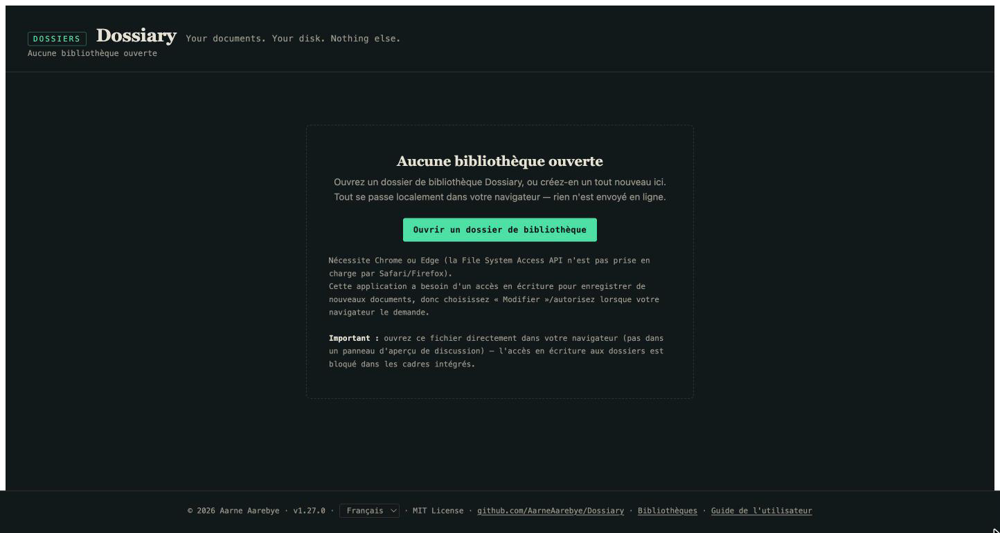
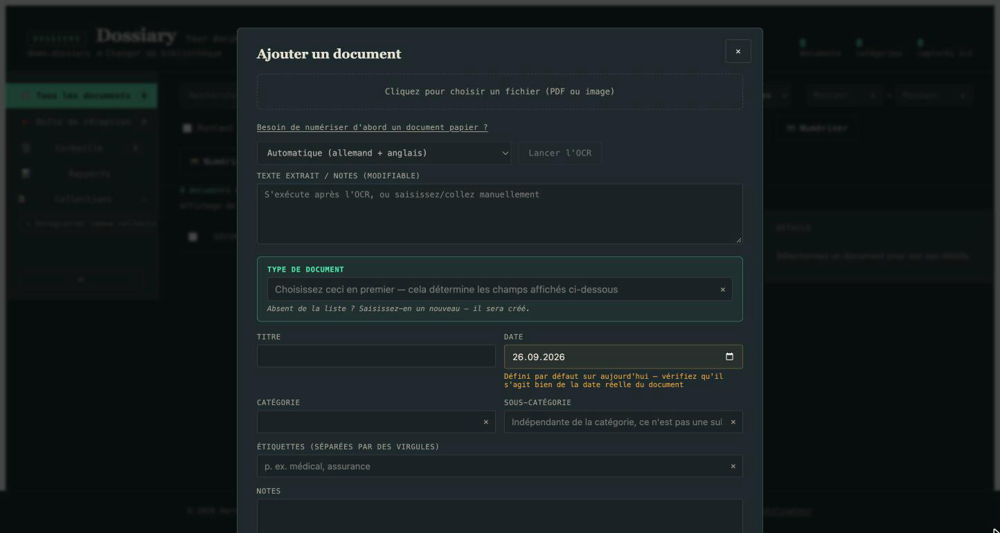
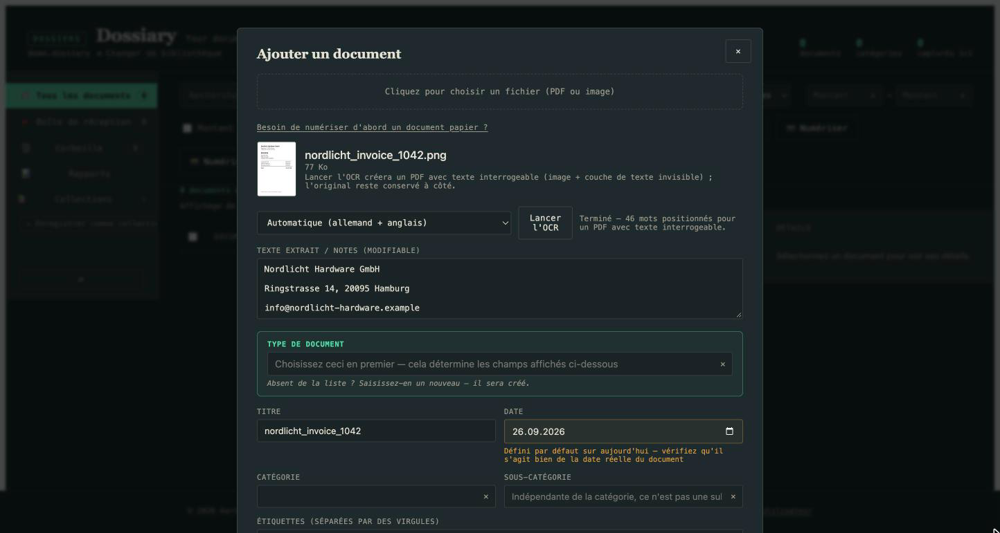
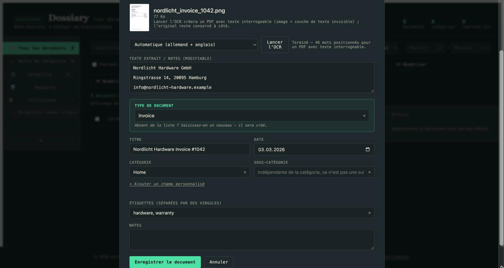
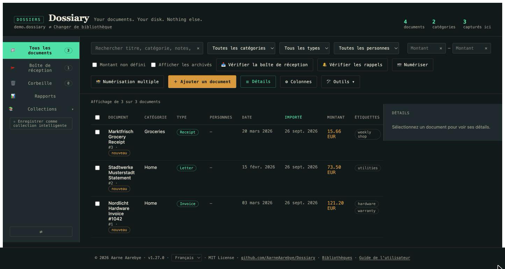
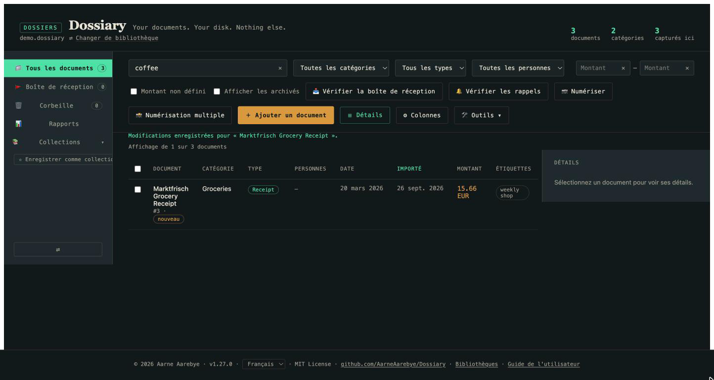
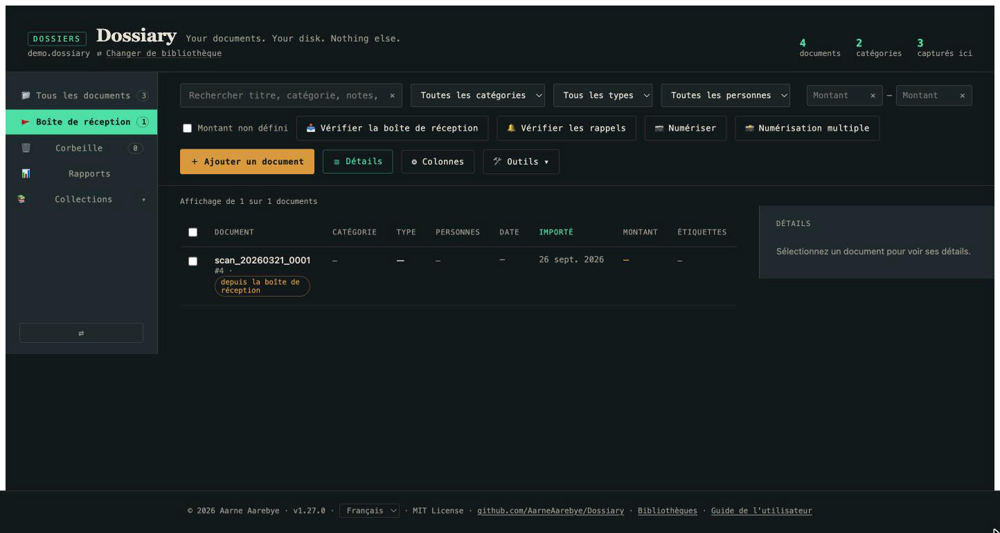
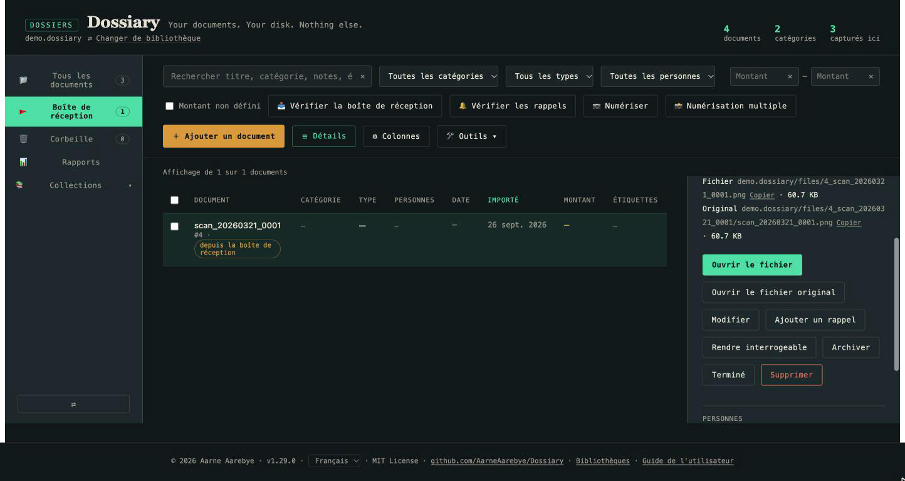
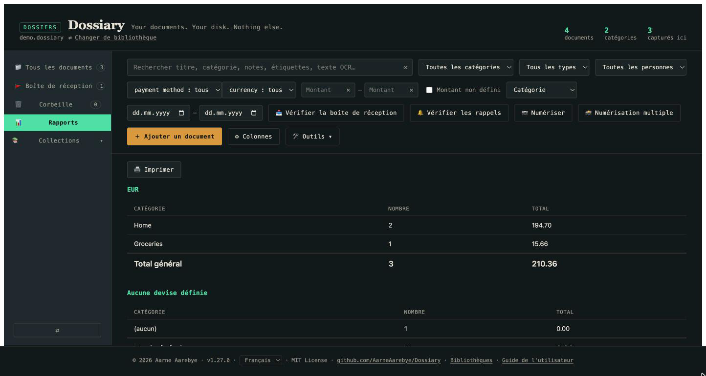

# Guide de l'utilisateur Dossiary

*Nouveau sur Dossiary ? Vous êtes au bon endroit. Vous cherchez les
détails techniques — le schéma de la base de données, les rouages de la
migration, la configuration des tests ? Consultez [README.md](README.md)
(en anglais) ou [README.de.md](README.de.md) (en allemand). Ce guide est
délibérément non technique.*

*[This guide in English](USER_GUIDE.md) · [Diese Anleitung auf Deutsch](USER_GUIDE.de.md) · [Esta guía en español](USER_GUIDE.es.md) · [简体中文版](USER_GUIDE.zh-Hans.md) · [繁體中文版](USER_GUIDE.zh-Hant.md)*

## Qu'est-ce que Dossiary ?

Dossiary est une archive de documents privée et personnelle. Vous
numérisez ou photographiez vos documents papier — factures, courriers,
reçus, contrats, tout ce qui finirait autrement dans un tiroir — et
Dossiary les garde organisés, consultables et lisibles, pour toujours.

Quelques éléments distinguent Dossiary d'une "app de gestion documentaire"
classique :

- **C'est juste un fichier.** Un seul fichier `dossiary.html`, téléchargé
  une fois. Pas d'installation, pas de compte, pas d'abonnement.
- **Rien ne quitte votre ordinateur.** Il n'y a ni serveur, ni cloud, ni
  envoi de données. Tout se passe dans votre navigateur, qui lit et écrit
  directement dans un dossier que vous choisissez sur votre propre disque.
- **Vous gardez vos données même si vous arrêtez d'utiliser l'app.**
  Votre bibliothèque est un dossier ordinaire contenant des fichiers (une
  petite base de données plus vos documents originaux) que vous pouvez
  ouvrir, copier ou sauvegarder comme n'importe quel autre dossier.

Si cela vous intéresse, le reste de ce guide explique comment utiliser
l'application concrètement.

## Premiers pas

1. **Téléchargez `dossiary.html`** depuis le
   [dépôt GitHub](https://github.com/AarneAarebye/Dossiary) et ouvrez-le
   dans Chrome ou Edge (l'un de ces deux navigateurs est nécessaire —
   Safari et Firefox ne prennent pas en charge la technologie sous-jacente
   dont l'app a besoin pour lire et écrire des fichiers sur votre disque).
2. Vous verrez l'écran "Aucune bibliothèque ouverte". C'est normal —
   c'est la toute première chose que vous voyez avant d'avoir choisi un
   dossier pour vos archives.

   

3. Cliquez sur **Ouvrir un dossier de bibliothèque** et choisissez (ou
   créez) un dossier vide quelque part sur votre ordinateur — il
   deviendra votre bibliothèque de documents. Votre navigateur vous
   demandera la permission de lire et d'écrire dans ce dossier ;
   autorisez-la, c'est ainsi que Dossiary enregistre vos documents.
4. Le dossier étant vide, Dossiary vous proposera de le configurer comme
   une toute nouvelle bibliothèque. Cliquez sur **Initialiser une nouvelle
   bibliothèque ici**. Dossiary crée un petit fichier de base de données
   et quelques dossiers à l'intérieur — c'est tout ce qu'il touche sur
   votre disque.
5. Vous disposez alors d'une bibliothèque vide, prête à l'emploi — prête
   pour votre premier document.

La prochaine fois que vous voudrez utiliser Dossiary, ouvrez simplement à
nouveau `dossiary.html` — l'app se souvient de cette bibliothèque et vous
propose de la rouvrir en un clic.

## Ajouter votre premier document

Cliquez sur **+ Ajouter un document**. Cela ouvre le formulaire de
capture :

1. Cliquez sur le cadre en pointillés en haut et choisissez un fichier —
   une photo ou un scan de votre document (JPEG/PNG), ou un PDF. (Si vous
   ne l'avez pas encore numérisé, le lien "Besoin de numériser d'abord un
   document papier ?" vous donne des indications rapides selon votre
   système d'exploitation.)
2. Une fois le fichier choisi, cliquez sur **Lancer l'OCR**. Cela extrait
   le texte de l'image pour qu'il devienne ensuite consultable — par
   défaut, Dossiary reconnaît l'anglais et l'allemand (le français et
   d'autres langues sont aussi disponibles en les sélectionnant dans le
   menu déroulant). Patientez quelques secondes ; le texte extrait
   apparaît dans le champ ci-dessous, modifiable si l'OCR s'est trompé
   quelque part :

   

3. Complétez le reste : choisissez ou saisissez un **Type de document**
   (Facture, Courrier, Reçu — ce qui a du sens ; les nouveaux types se
   créent simplement en les tapant), un **Titre**, la **Date** réelle du
   document, une **Catégorie** et les **Étiquettes** que vous souhaitez
   utiliser plus tard pour filtrer. Rien de tout cela n'est obligatoire
   à part le type de document — ne remplissez que ce qui vous est utile.

   

4. Cliquez sur **Enregistrer le document**. C'est fait — votre document
   se trouve désormais dans votre bibliothèque de façon permanente,
   accompagné du texte extrait.

Répétez ce processus pour autant de documents que vous le souhaitez.
Chacun obtient sa propre ligne dans votre tableau de documents :

## Le retrouver ensuite

Tout cela n'a d'intérêt que si vous pouvez retrouver quelque chose en
quelques secondes, des mois ou des années plus tard. En haut du tableau :

- La **recherche** parcourt les titres, catégories, notes, étiquettes et
  le texte reconnu par OCR — donc même si vous ne vous souvenez plus
  comment vous avez appelé un document, taper un mot que vous savez avoir
  figuré *sur* le document le retrouvera généralement.
- Les **filtres** (catégorie, type, personne) réduisent le tableau à ce
  qui correspond.
- Cliquez sur n'importe quel **en-tête de colonne** pour trier selon
  celle-ci.

## La pile de papiers du quotidien

Capturer un document à la fois via le formulaire fonctionne, mais la
plupart des gens ne reçoivent pas leurs documents un par un — ils
arrivent en pile, ou sortent d'un scanner par lots. Dossiary propose un
chemin plus léger pour cela : la **Boîte de réception**.

Chaque bibliothèque possède un dossier `inbox` juste à côté de votre
fichier de bibliothèque. Déposez-y les fichiers numérisés — en les
glissant vous-même, via la fonction "enregistrer dans un dossier" de
votre propre scanner, ou (pour une version entièrement automatisée) avec
le script `scan_watch.py` fourni et décrit dans le README technique —
puis cliquez sur **Vérifier la boîte de réception** dans Dossiary.

Chaque fichier en attente est immédiatement ajouté, avec seulement un
titre dérivé du nom de fichier et rien d'autre de rempli, et atterrit
dans une file de révision plutôt que directement dans votre liste
principale de documents :

Cliquez sur l'un d'eux pour remplir à votre rythme les détails qui vous
importent (catégorie, type, étiquettes, date), puis marquez-le comme
**Terminé** — ou **archivez-le**, ou **supprimez-le** s'il s'avère qu'il
ne mérite pas d'être conservé. Rien n'est jamais silencieusement écarté ;
chacune de ces actions peut être annulée depuis la propre vue de détail
du document.

C'est la réponse pratique à "comment faire entrer toutes mes archives
papier ici" : numérisez tout vers la Boîte de réception par lots, puis
traitez la file de révision dès que vous avez quelques minutes de libre,
plutôt que de devoir remplir soigneusement un formulaire pour chaque
feuille de papier numérisée.

## Un rapide tour de tout le reste

Une fois à l'aise avec les bases ci-dessus, il y a d'autres éléments qui
valent la peine d'être connus — chacun est réellement utile, mais aucun
n'est nécessaire pour démarrer, donc cette section reste volontairement
brève.

- **Rapports** — des totaux regroupés par catégorie, type ou personne,
  avec un filtre de plage de dates. Utile pour la déclaration d'impôts ou
  pour le remboursement de frais.

  

- **Collections** — regroupez des documents ensemble, soit manuellement
  (sélection et ajout), soit sous forme de "Collection intelligente" qui
  se met automatiquement à jour selon votre recherche/filtre actuel à
  mesure que de nouveaux documents arrivent.
- **Archiver** — une marque signifiant "je n'ai plus besoin de voir ceci
  dans ma liste quotidienne, mais ne le supprime pas", indépendante de la
  Corbeille.
- **Corbeille** — supprimer un document ne détruit rien sur le disque ;
  il est déplacé vers la Corbeille, entièrement récupérable, pour
  toujours (il n'y a pas de bouton "vider la corbeille" — cette
  application ne détruit jamais vos données de façon permanente).
- **Champs personnalisés** — au-delà des champs intégrés, vous pouvez
  ajouter les vôtres (Auteur, Payé, Remboursable, tout ce dont vos
  documents ont besoin) directement depuis le formulaire de capture ou
  d'édition, par type de document.

## Et ensuite ?

- Curieux de savoir comment Dossiary stocke réellement vos données, ou
  vous voulez voir la liste complète des fonctionnalités et de leurs cas
  particuliers ? Consultez le [README](README.md) technique.
- Vous migrez depuis une ancienne bibliothèque Mariner Paperless ?
  Consultez [MIGRATION.md](MIGRATION.md) — c'est une étape de conversion
  unique que ce guide ne couvre pas.
