# Dossiary User Guide

*New to Dossiary? Start here. Looking for the technical details — the
database schema, migration internals, testing setup? See
[README.md](README.md) instead. This guide is deliberately non-technical.*

*[Diese Anleitung auf Deutsch](USER_GUIDE.de.md) · [Esta guía en español](USER_GUIDE.es.md) · [Ce guide en français](USER_GUIDE.fr.md)*

## What is Dossiary?

Dossiary is a private, personal document archive. You scan or photograph
your paper documents — invoices, letters, receipts, contracts, whatever
you'd otherwise stuff in a drawer — and Dossiary keeps them organized,
searchable, and readable, forever.

A few things make it different from a typical "document management app":

- **It's just a file.** One `dossiary.html` file, downloaded once. No
  installation, no account, no subscription.
- **Nothing leaves your computer.** There's no server, no cloud, no
  upload. Everything happens in your browser, reading and writing
  directly to a folder you choose on your own disk.
- **You keep the data even if you stop using the app.** Your library is
  a plain folder of files (a small database file plus your original
  documents) that you can open, copy, or back up like any other folder.

If that sounds appealing, the rest of this guide walks through actually
using it.

## Getting started

1. **Download `dossiary.html`** from the
   [GitHub repository](https://github.com/AarneAarebye/Dossiary) and open
   it in Chrome or Edge (it needs one of those two browsers — Safari and
   Firefox don't support the underlying technology it relies on to read
   and write files on your disk).
2. You'll see a "No library open" screen. This is normal — it's the very
   first thing you see before you've picked a folder for your archive.

   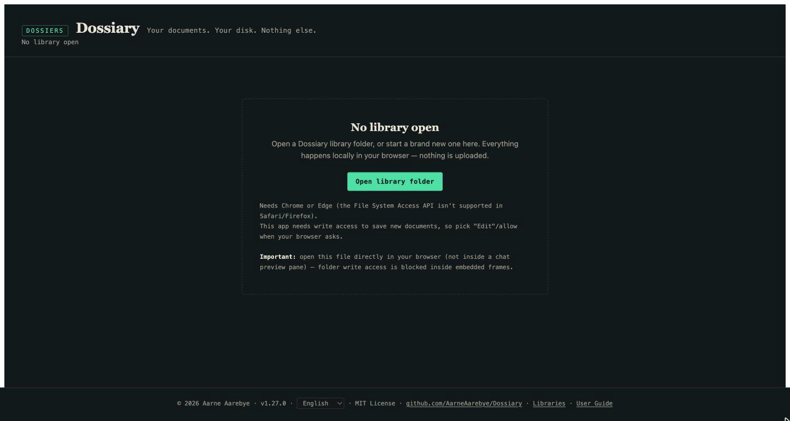

3. Click **Open library folder** and choose (or create) an empty folder
   somewhere on your computer — this will become your document library.
   Your browser will ask for permission to read and write to that folder;
   allow it, since that's how Dossiary saves your documents.
4. Since the folder is empty, Dossiary offers to set it up as a brand new
   library:

   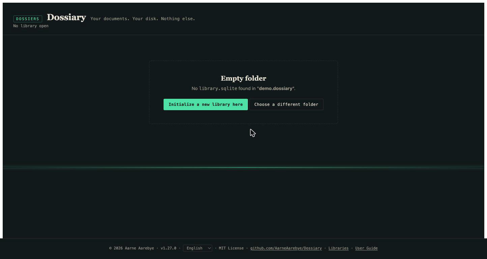

   Click **Initialize a new library here**. Dossiary creates a small
   database file and a couple of folders inside — that's the entire
   footprint. Nothing else touches your disk.
5. You now have an empty, ready-to-use library:

   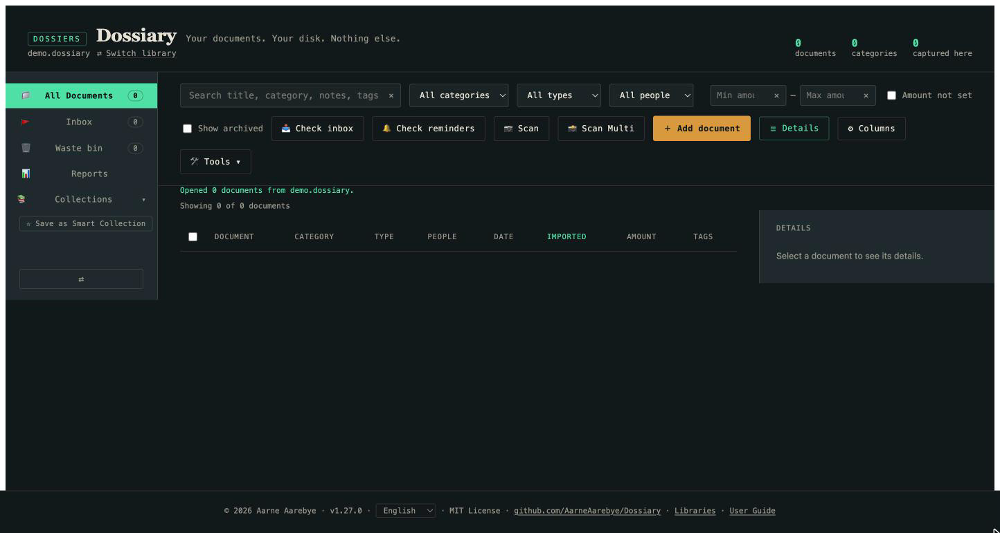

The next time you want to use Dossiary, just open `dossiary.html` again —
it remembers this library and offers to reopen it with one click.

## Adding your first document

Click **+ Add document**. This opens the capture form:

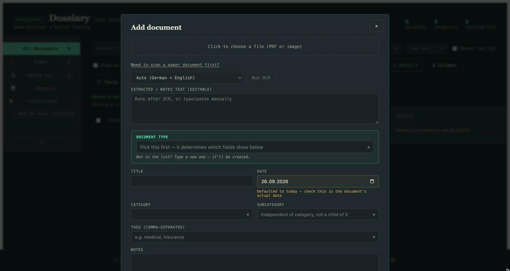

1. Click the dashed box at the top and choose a file — a photo or scan of
   your document (JPEG/PNG), or a PDF. (If you haven't scanned it yet, the
   "Need to scan a paper document first?" link gives quick pointers for
   your operating system's built-in scanning tools.)
2. Once a file is chosen, click **Run OCR**. This reads the text out of
   the image so it becomes searchable later — Dossiary recognizes both
   English and German by default (other languages are selectable too).
   Give it a few seconds; the extracted text appears in the box below,
   editable if OCR got anything wrong:

   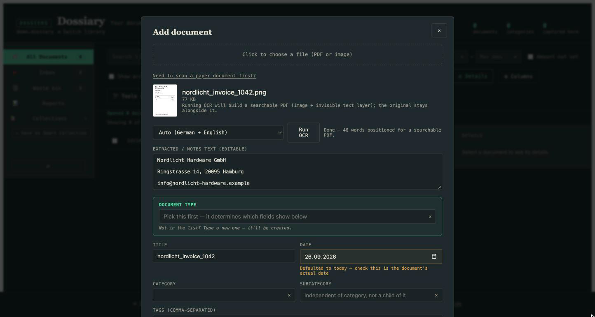

3. Fill in the rest: pick or type a **Document Type** (Invoice, Letter,
   Receipt — whatever makes sense; new types are created just by typing
   them), a **Title**, the document's actual **Date**, a **Category**,
   and any **Tags** you want to filter by later. None of this is
   mandatory beyond a Document Type — fill in only what's useful to you.

   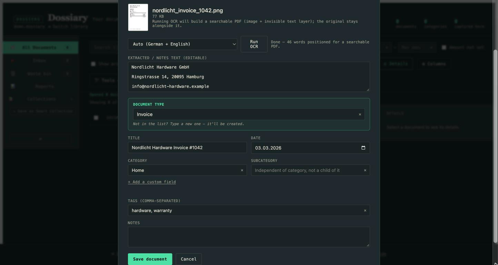

4. Click **Save document**. That's it — your document is now in your
   library, permanently, alongside its extracted text.

Repeat this for as many documents as you like. Each one gets its own
entry in your document table:

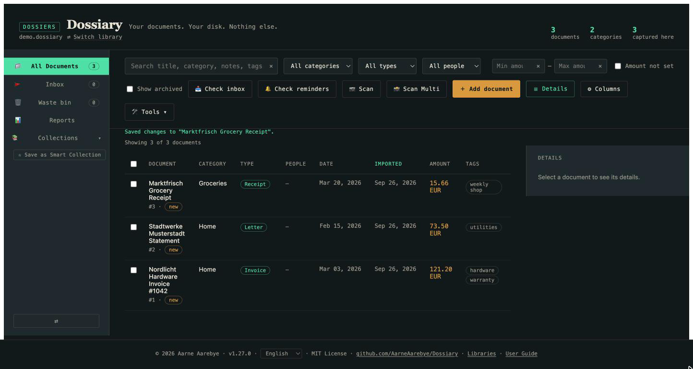

## Finding it again

The whole point of doing this is being able to find something again in
seconds, months or years later. At the top of the table:

- **Search** looks across titles, categories, notes, tags, and the OCR'd
  text — so even if you don't remember what you called something, typing
  a word you know was *on* the document will usually find it.
- **Filters** (category, type, person) narrow the table to just what
  matches.
- Click any **column header** to sort by it.

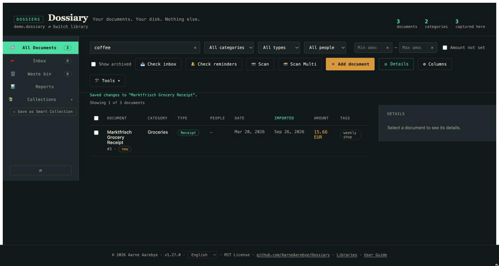

## The everyday paper pile

Capturing one document at a time through the form works, but most people
don't get their paperwork one piece at a time — it arrives as a stack, or
comes off a scanner in a batch. Dossiary has a lighter-weight path for
that: the **Inbox**.

Every library has an `inbox` folder sitting right next to your library
file. Drop scanned files into it — by dragging them there yourself, from
your scanner's own "save to folder" feature, or (for a fully automated
version) using the included `scan_watch.py` helper script described in
the technical README — and then click **Check inbox** in Dossiary.

Every file waiting there gets added immediately, with just a
filename-based title and nothing else filled in, and lands in a review
queue rather than your main document list:

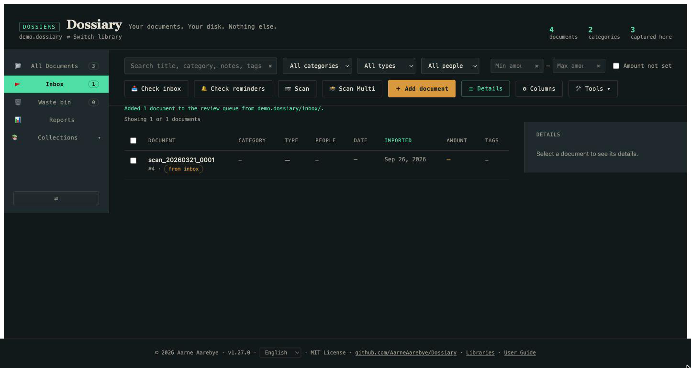

Click into one to fill in the details you care about (category, type,
tags, date) at your own pace, then mark it **Done** — or **Archive** it,
or **Delete** it if it turns out to be nothing worth keeping. Nothing is
ever silently discarded; every one of these actions can be undone from
the document's own detail view.

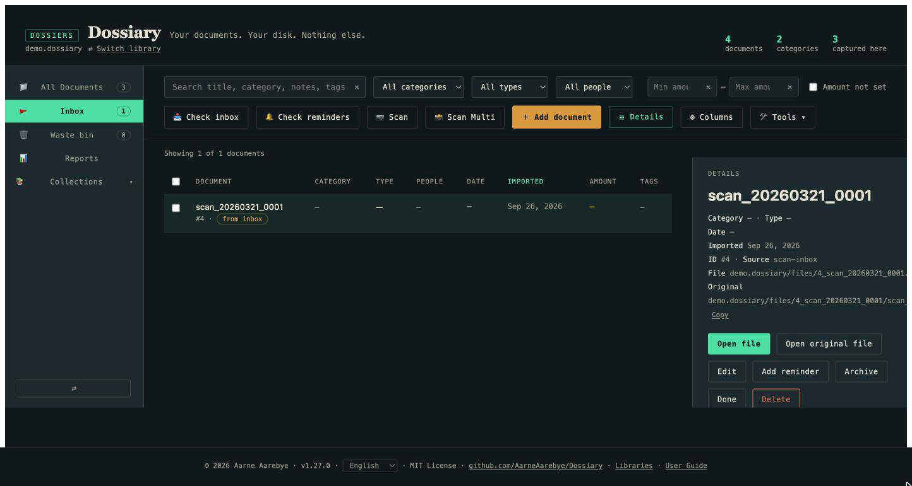

This is the practical answer to "how do I get my whole paper archive in":
scan everything into the Inbox in batches, then work through the review
queue whenever you have a few spare minutes, instead of having to
carefully fill in a form for every single sheet of paper the moment you
scan it.

## A quick tour of everything else

Once you're comfortable with the basics above, there's more worth
knowing about — each is genuinely useful, but none of it is necessary to
get started, so this section is intentionally brief.

- **Reports** — totals grouped by category, type, or person, with a date
  range filter. Useful for tax season or expense reimbursement.

  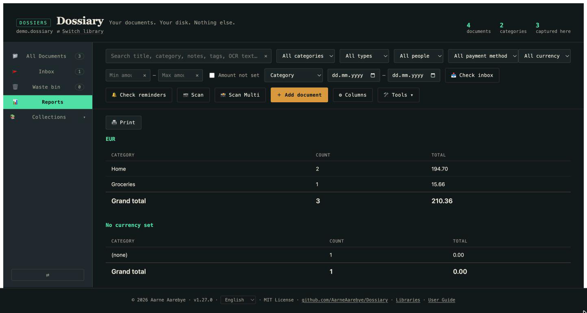

- **Collections** — save a group of documents together, either by hand
  (drag-select and add) or as a "Smart Collection" that automatically
  keeps matching your current search/filter as new documents arrive.

  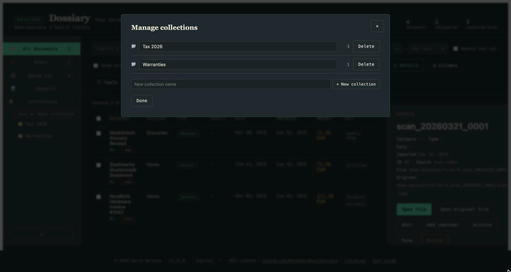

- **Archive** — a "no longer need to see this in my everyday list, but
  don't delete it" flag, separate from the Waste bin.
- **Waste bin** — deleting a document doesn't destroy anything on disk;
  it moves to the Waste bin, fully restorable, forever (there's no
  "empty bin" button — this app never permanently destroys your data).
- **Custom fields** — beyond the built-in fields, you can add your own
  (Author, Paid, Reimbursable, whatever your documents need) right from
  the capture or edit form, per document type.

## Where to go next

- Curious how Dossiary actually stores your data, or want the full list
  of features and their edge cases? See the technical
  [README](README.md).
- Migrating from an old Mariner Paperless library? See
  [MIGRATION.md](MIGRATION.md) — that's a one-time conversion step, not
  something this guide covers.
