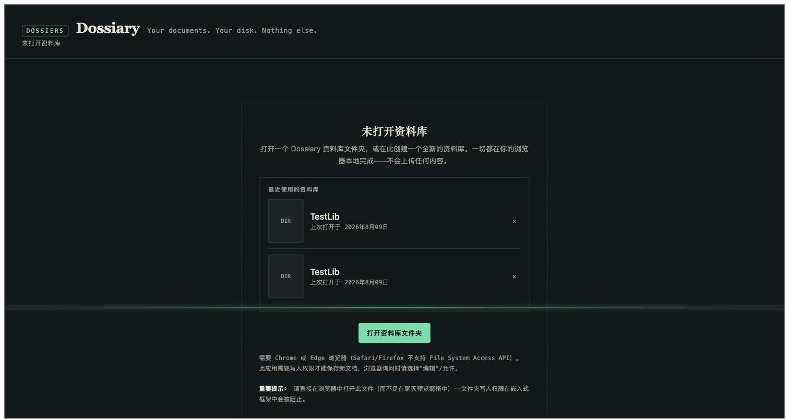
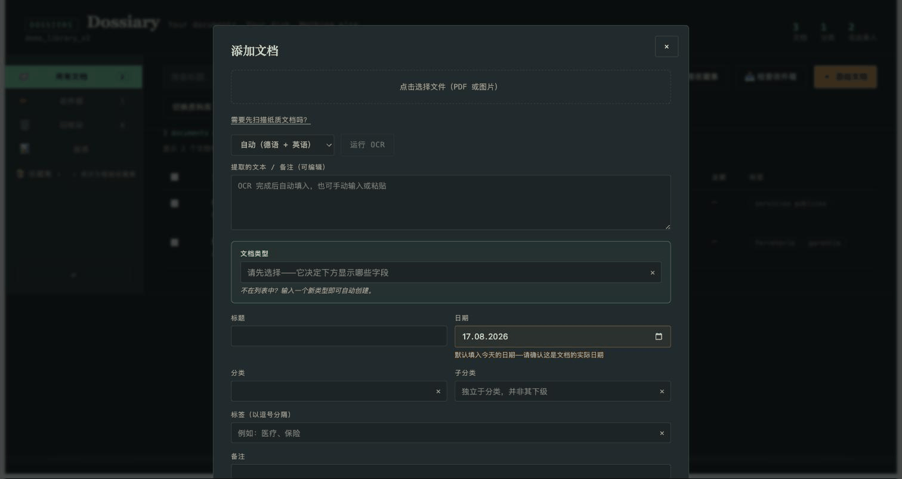
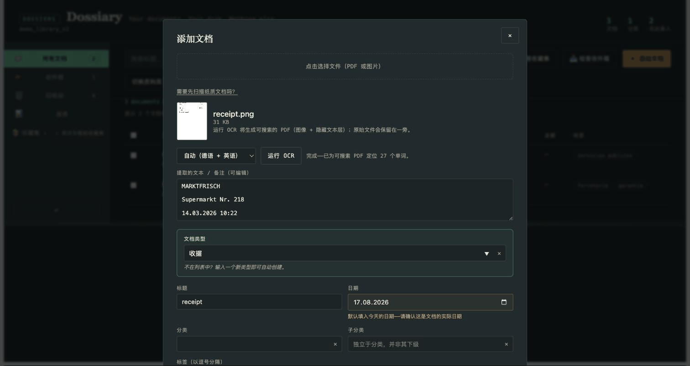
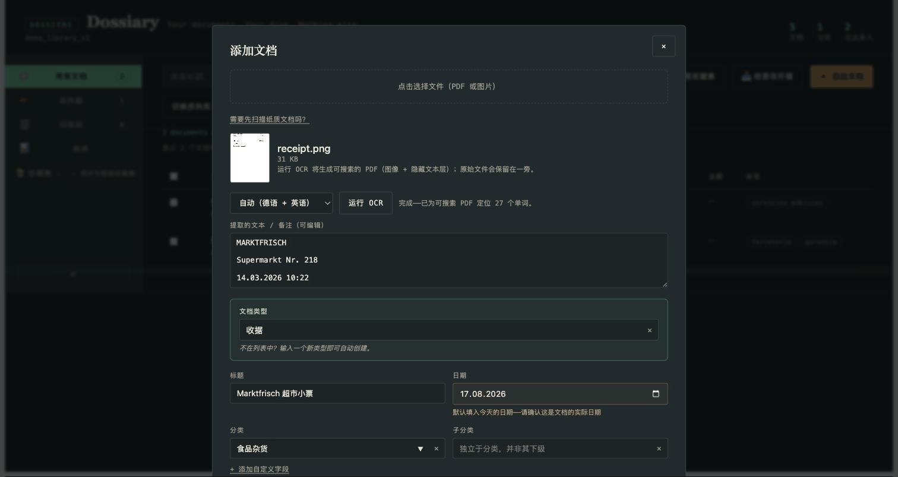
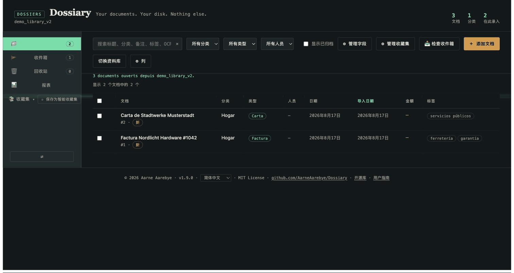
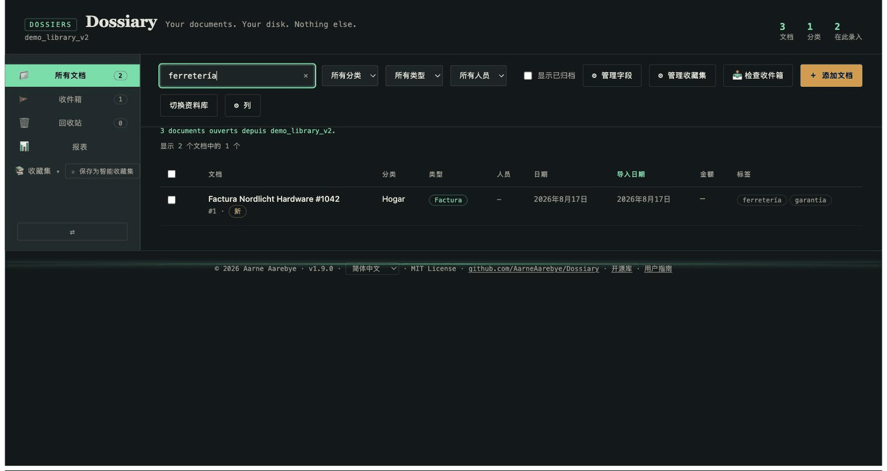
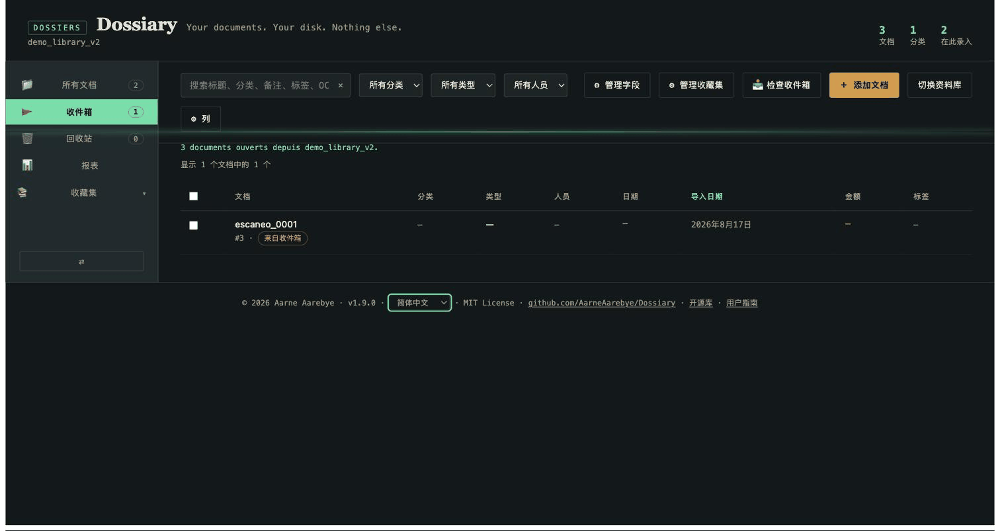
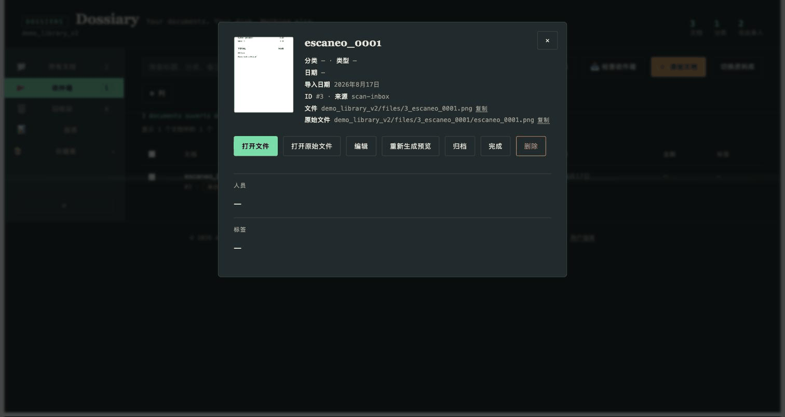
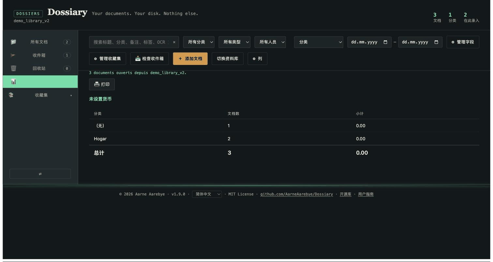

# Dossiary 用户指南

*刚开始使用 Dossiary？你来对地方了。想找技术细节——数据库结构、迁移原理、
测试配置？请查阅 [README.md](README.md)（英文）或 [README.de.md](README.de.md)
（德文）。本指南刻意保持非技术性。*

*[This guide in English](USER_GUIDE.md) · [Diese Anleitung auf Deutsch](USER_GUIDE.de.md) · [Esta guía en español](USER_GUIDE.es.md) · [Ce guide en français](USER_GUIDE.fr.md)*

## Dossiary 是什么？

Dossiary 是一个私人的、个人的文档档案库。你扫描或拍摄纸质文档——发票、
信件、收据、合同，任何原本会被塞进抽屉里的东西——Dossiary 会将它们永久
地整理好、变得可搜索、保持可读。

有几点让 Dossiary 与典型的"文档管理应用"不同：

- **它只是一个文件。** 一个单独的 `dossiary.html` 文件，下载一次即可。
  无需安装，无需账户，无需订阅。
- **没有任何数据离开你的电脑。** 没有服务器，没有云端，没有上传。一切
  都在你的浏览器中完成，直接读写你自己选择的、位于你自己硬盘上的文件夹。
- **即使停止使用这个应用，你的数据依然属于你。** 你的资料库就是一个
  普通的文件夹（一个小型数据库文件加上你的原始文档），你可以像对待
  任何其他文件夹一样打开、复制或备份它。

如果这听起来不错，本指南的其余部分将说明如何实际使用它。

## 起步

1. 从 [GitHub 仓库](https://github.com/AarneAarebye/Dossiary) **下载
   `dossiary.html`**，然后用 Chrome 或 Edge 打开它（需要这两种浏览器之一
   ——Safari 和 Firefox 不支持应用在你硬盘上读写文件所依赖的底层技术）。
2. 你会看到"未打开资料库"界面。这是正常的——在你选择存放档案的文件夹
   之前，这是你看到的第一个画面。

   

3. 点击**打开资料库文件夹**，选择（或新建）电脑上的一个空文件夹——它将
   成为你的文档资料库。浏览器会请求读写该文件夹的权限；请授予它，因为
   Dossiary 正是这样保存你的文档的。
4. 由于文件夹是空的，Dossiary 会提示将其设置为全新的资料库。点击**在此
   初始化新资料库**。Dossiary 会在其中创建一个小型数据库文件和几个文件
   夹——这就是它对你硬盘的全部操作。
5. 完成后，你就拥有了一个空的、随时可用的资料库——可以添加第一份文档了。

下次想使用 Dossiary 时，只需再次打开 `dossiary.html`——应用会记住这个
资料库，并提供一键重新打开的选项。

## 添加你的第一份文档

点击**添加文档**。这会打开采集表单：

1. 点击顶部的虚线框，选择一个文件——你文档的照片或扫描件（JPEG/PNG），
   或 PDF。（如果你还没有扫描它，"需要先扫描纸质文档吗？"链接会根据你的
   操作系统给出快速指引。）
2. 选好文件后，点击**运行 OCR**。这会从图像中提取文字，使其之后可以被
   搜索到——Dossiary 默认识别英语和德语（中文及其他语言也可以在下拉菜单
   中选择）。等待几秒钟；提取的文字会出现在下方的文本框中，如果 OCR 识
   别有误，你可以直接编辑它：

   

3. 填写其余内容：选择或输入一个**文档类型**（发票、信件、收据——任何合
   适的类型；直接输入新类型即可自动创建），一个**标题**，文档的真实
   **日期**，一个**分类**，以及你之后想用来筛选的**标签**。除了文档类型
   之外，其他都不是必填项——只填写对你有用的内容。

   

4. 点击**保存文档**。就这样——你的文档连同提取的文字已永久保存在你的
   资料库中。

对你想要的所有文档重复这个过程。每一份都会在你的文档表格中获得自己的
条目：

## 重新找到它

做这一切的全部意义，就是能在几个月甚至几年后，用几秒钟重新找到某份文档。
在表格顶部：

- **搜索**会检索标题、分类、备注、标签以及 OCR 识别出的文字——因此即使
  你不记得自己给某份文档起了什么名字，只要输入一个你知道曾出现*在*文档
  上的词，通常也能找到它。
- **筛选器**（分类、类型、人员）会将表格缩小到匹配的内容。
- 点击任意**列标题**即可按该列排序。

## 日常的一叠纸

通过表单一次采集一份文档是可行的，但大多数人的文件不会一份一份地到来
——它们往往成堆出现，或从扫描仪批量输出。Dossiary 为此提供了一条更轻
量的路径：**收件箱**。

每个资料库旁边都有一个 `inbox` 文件夹，就在资料库文件旁边。把扫描好的
文件放进去——可以自己拖进去，用扫描仪自带的"保存到文件夹"功能，或者
（如需完全自动化）使用附带的 `scan_watch.py` 脚本（技术版 README 中有
说明）——然后在 Dossiary 中点击**检查收件箱**。

其中等待的每一份文件都会被立即添加，只带有一个从文件名推断出的标题，
其余字段留空，并进入待审核队列，而不是直接进入你的主文档列表：

点进其中一份，按你自己的节奏填写你关心的细节（分类、类型、标签、日期），
然后将其标记为**完成**——或者**归档**它，或者如果它其实不值得保留，就
**删除**它。任何操作都不会悄无声息地被丢弃；上述每一个操作都可以从该
文档自己的详情视图中撤销。

这就是"如何把我全部的纸质档案搬进这里"这个问题的实际答案：把所有东西
成批扫描进收件箱，然后在你有几分钟空闲时逐步处理待审核队列，而不必在
扫描每一张纸的那一刻就仔细填写一份表单。

## 其他功能速览

熟悉了以上基础内容之后，还有一些值得了解的功能——每一个都真正有用，
但都不是入门的必要条件，因此本节刻意保持简短。

- **报表**——按分类、类型或人员分组的合计数据，附带日期范围筛选。适合
  报税季或费用报销。

  

- **收藏集**——将一组文档收集在一起，可以手动完成（选择并添加），也可以
  创建"智能收藏集"，它会随着新文档的到来，自动保持与你当前的搜索/筛选
  条件一致。
- **归档**——一个"我不再需要在日常列表中看到它，但不要删除它"的标记，
  独立于回收站。
- **回收站**——删除文档不会在磁盘上销毁任何内容；它会移动到回收站，
  可以永久完整恢复（没有"清空回收站"按钮——这个应用永远不会永久销毁你
  的数据）。
- **自定义字段**——除了内置字段之外，你还可以直接在采集或编辑表单中，
  按文档类型添加自己的字段（作者、已付款、可报销，任何你的文档需要的
  字段）。

## 接下来去哪里？

- 好奇 Dossiary 究竟是如何存储你的数据的，或者想查看完整的功能列表及
  其边缘情况？请查阅技术版 [README](README.md)。
- 正在从旧版 Mariner Paperless 资料库迁移？请查阅
  [MIGRATION.md](MIGRATION.md)——这是一次性的转换步骤，本指南不涉及。
