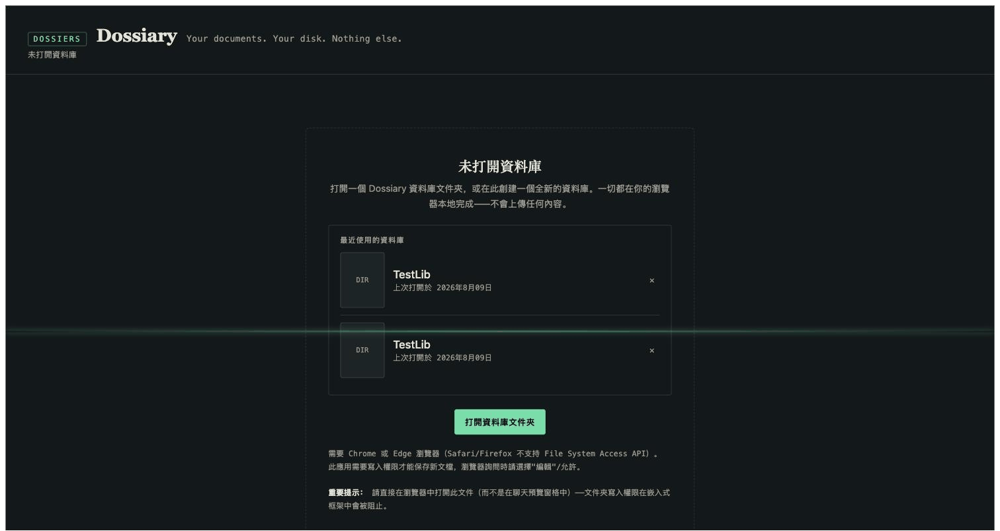
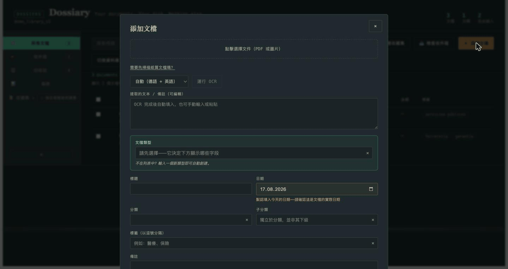
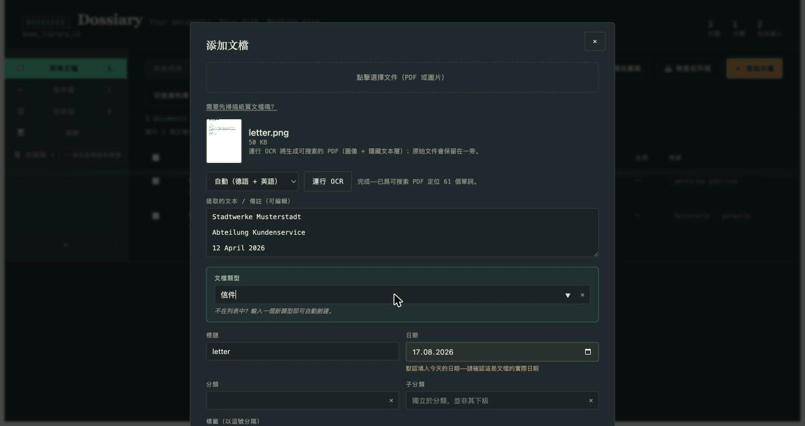
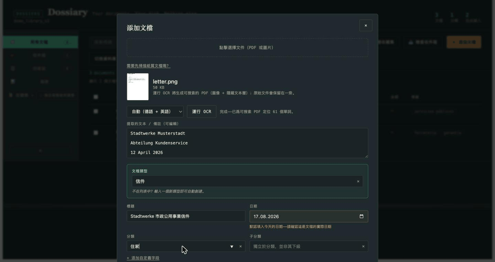
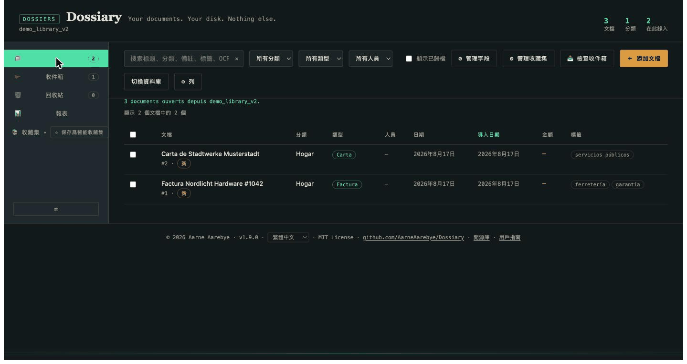
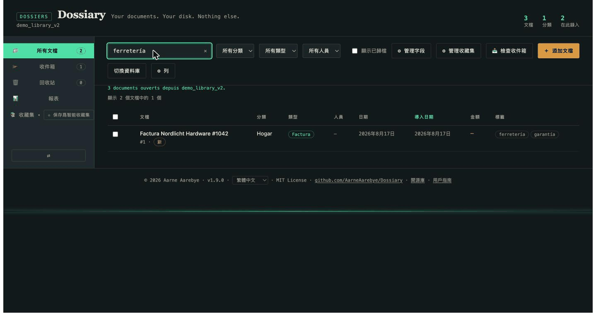
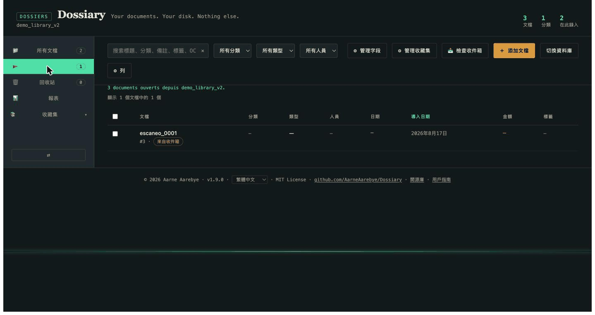
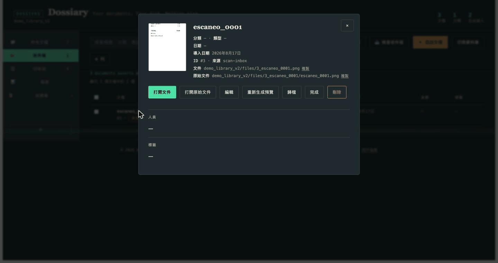
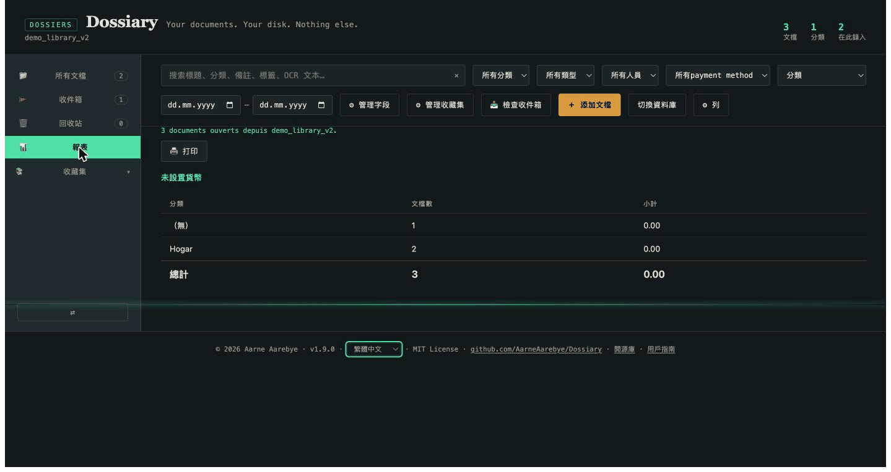

# Dossiary 用戶指南

*剛開始使用 Dossiary？你來對地方了。想找技術細節——數據庫結構、遷移原理、
測試配置？請查閱 [README.md](README.md)（英文）或 [README.de.md](README.de.md)
（德文）。本指南刻意保持非技術性。*

*[This guide in English](USER_GUIDE.md) · [Diese Anleitung auf Deutsch](USER_GUIDE.de.md) · [Esta guía en español](USER_GUIDE.es.md) · [Ce guide en français](USER_GUIDE.fr.md) · [简体中文版](USER_GUIDE.zh-Hans.md)*

## Dossiary 是什麼？

Dossiary 是一個私人的、個人的文檔檔案庫。你掃描或拍攝紙質文檔——發票、
信件、收據、合同，任何原本會被塞進抽屜裏的東西——Dossiary 會將它們永久
地整理好、變得可搜索、保持可讀。

有幾點讓 Dossiary 與典型的"文檔管理應用"不同：

- **它只是一個文件。** 一個單獨的 `dossiary.html` 文件，下載一次即可。
  無需安裝，無需賬戶，無需訂閱。
- **沒有任何數據離開你的電腦。** 沒有服務器，沒有云端，沒有上傳。一切
  都在你的瀏覽器中完成，直接讀寫你自己選擇的、位於你自己硬盤上的文件夾。
- **即使停止使用這個應用，你的數據依然屬於你。** 你的資料庫就是一個
  普通的文件夾（一個小型數據庫文件加上你的原始文檔），你可以像對待
  任何其他文件夾一樣打開、複製或備份它。

如果這聽起來不錯，本指南的其餘部分將說明如何實際使用它。

## 起步

1. 從 [GitHub 倉庫](https://github.com/AarneAarebye/Dossiary) **下載
   `dossiary.html`**，然後用 Chrome 或 Edge 打開它（需要這兩種瀏覽器之一
   ——Safari 和 Firefox 不支持應用在你硬盤上讀寫文件所依賴的底層技術）。
2. 你會看到"未打開資料庫"界面。這是正常的——在你選擇存放檔案的文件夾
   之前，這是你看到的第一個畫面。

   

3. 點擊**打開資料庫文件夾**，選擇（或新建）電腦上的一個空文件夾——它將
   成爲你的文檔資料庫。瀏覽器會請求讀寫該文件夾的權限；請授予它，因爲
   Dossiary 正是這樣保存你的文檔的。
4. 由於文件夾是空的，Dossiary 會提示將其設置爲全新的資料庫。點擊**在此
   初始化新資料庫**。Dossiary 會在其中創建一個小型數據庫文件和幾個文件
   夾——這就是它對你硬盤的全部操作。
5. 完成後，你就擁有了一個空的、隨時可用的資料庫——可以添加第一份文檔了。

下次想使用 Dossiary 時，只需再次打開 `dossiary.html`——應用會記住這個
資料庫，並提供一鍵重新打開的選項。

## 添加你的第一份文檔

點擊**添加文檔**。這會打開採集表單：

1. 點擊頂部的虛線框，選擇一個文件——你文檔的照片或掃描件（JPEG/PNG），
   或 PDF。（如果你還沒有掃描它，"需要先掃描紙質文檔嗎？"鏈接會根據你的
   操作系統給出快速指引。）
2. 選好文件後，點擊**運行 OCR**。這會從圖像中提取文字，使其之後可以被
   搜索到——Dossiary 默認識別英語和德語（中文及其他語言也可以在下拉菜單
   中選擇）。等待幾秒鐘；提取的文字會出現在下方的文本框中，如果 OCR 識
   別有誤，你可以直接編輯它：

   

3. 填寫其餘內容：選擇或輸入一個**文檔類型**（發票、信件、收據——任何合
   適的類型；直接輸入新類型即可自動創建），一個**標題**，文檔的真實
   **日期**，一個**分類**，以及你之後想用來篩選的**標籤**。除了文檔類型
   之外，其他都不是必填項——只填寫對你有用的內容。

   

4. 點擊**保存文檔**。就這樣——你的文檔連同提取的文字已永久保存在你的
   資料庫中。

對你想要的所有文檔重複這個過程。每一份都會在你的文檔表格中獲得自己的
條目：

## 重新找到它

做這一切的全部意義，就是能在幾個月甚至幾年後，用幾秒鐘重新找到某份文檔。
在表格頂部：

- **搜索**會檢索標題、分類、備註、標籤以及 OCR 識別出的文字——因此即使
  你不記得自己給某份文檔起了什麼名字，只要輸入一個你知道曾出現*在*文檔
  上的詞，通常也能找到它。
- **篩選器**（分類、類型、人員）會將表格縮小到匹配的內容。
- 點擊任意**列標題**即可按該列排序。

## 日常的一疊紙

通過表單一次採集一份文檔是可行的，但大多數人的文件不會一份一份地到來
——它們往往成堆出現，或從掃描儀批量輸出。Dossiary 爲此提供了一條更輕
量的路徑：**收件箱**。

每個資料庫旁邊都有一個 `inbox` 文件夾，就在資料庫文件旁邊。把掃描好的
文件放進去——可以自己拖進去，用掃描儀自帶的"保存到文件夾"功能，或者
（如需完全自動化）使用附帶的 `scan_watch.py` 腳本（技術版 README 中有
說明）——然後在 Dossiary 中點擊**檢查收件箱**。

其中等待的每一份文件都會被立即添加，只帶有一個從文件名推斷出的標題，
其餘字段留空，並進入待審覈隊列，而不是直接進入你的主文檔列表：

點進其中一份，按你自己的節奏填寫你關心的細節（分類、類型、標籤、日期），
然後將其標記爲**完成**——或者**歸檔**它，或者如果它其實不值得保留，就
**刪除**它。任何操作都不會悄無聲息地被丟棄；上述每一個操作都可以從該
文檔自己的詳情視圖中撤銷。

這就是"如何把我全部的紙質檔案搬進這裏"這個問題的實際答案：把所有東西
成批掃描進收件箱，然後在你有幾分鐘空閒時逐步處理待審覈隊列，而不必在
掃描每一張紙的那一刻就仔細填寫一份表單。

## 其他功能速覽

熟悉了以上基礎內容之後，還有一些值得了解的功能——每一個都真正有用，
但都不是入門的必要條件，因此本節刻意保持簡短。

- **報表**——按分類、類型或人員分組的合計數據，附帶日期範圍篩選。適合
  報稅季或費用報銷。

  

- **收藏集**——將一組文檔收集在一起，可以手動完成（選擇並添加），也可以
  創建"智能收藏集"，它會隨着新文檔的到來，自動保持與你當前的搜索/篩選
  條件一致。
- **歸檔**——一個"我不再需要在日常列表中看到它，但不要刪除它"的標記，
  獨立於回收站。
- **回收站**——刪除文檔不會在磁盤上銷燬任何內容；它會移動到回收站，
  可以永久完整恢復（沒有"清空回收站"按鈕——這個應用永遠不會永久銷燬你
  的數據）。
- **自定義字段**——除了內置字段之外，你還可以直接在採集或編輯表單中，
  按文檔類型添加自己的字段（作者、已付款、可報銷，任何你的文檔需要的
  字段）。

## 接下來去哪裏？

- 好奇 Dossiary 究竟是如何存儲你的數據的，或者想查看完整的功能列表及
  其邊緣情況？請查閱技術版 [README](README.md)。
- 正在從舊版 Mariner Paperless 資料庫遷移？請查閱
  [MIGRATION.md](MIGRATION.md)——這是一次性的轉換步驟，本指南不涉及。
